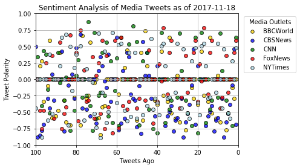
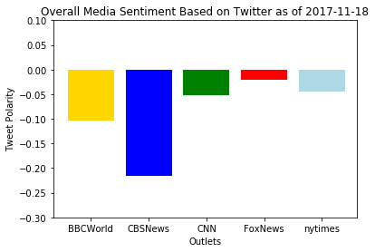

# Distinguishing Sentiments
Homework Week 7 - News Mood

This assignment uses Python libraries and the Tweepy API to perform a sentiment analysis and provide a visualized summary of the sentiments expressed in Tweets sent out by the following news organizations: BBC, CBS, CNN, Fox, and New York Times.

* Observations
    * One 
    * Two
    * Three 

```python
# Dependencies
import numpy as np
import pandas as pd
import matplotlib.pyplot as plt
import json
import tweepy
from datetime import datetime
```


```python
# Twitter API Keys
import os
consumer_key = os.getenv("twitter_consumer_key")
consumer_secret = os.getenv("twitter_consumer_secret")
access_token = os.getenv("twitter_access_token_key")
access_token_secret = os.getenv("twitter_access_token_secret")
```


```python
# Setup Tweepy API Authentication
auth = tweepy.OAuthHandler(consumer_key, consumer_secret)
auth.set_access_token(access_token, access_token_secret)
api = tweepy.API(auth, parser=tweepy.parsers.JSONParser())
```


```python
# Import and Initialize Sentiment Analyzer
from vaderSentiment.vaderSentiment import SentimentIntensityAnalyzer
analyzer = SentimentIntensityAnalyzer()
```


```python
# Create array with news outlet twitter handles
    #newsOutlets = ["BBCWorld", "nytimes"]
newsOutlets = ["BBCWorld", "CBSNews","CNN", "FoxNews", "nytimes"]
```


```python
# print a single tweet json for reference
test_tweet = api.user_timeline(newsOutlets[0])
print(json.dumps(test_tweet[0], sort_keys=True, indent=4))
```

    {
        "contributors": null,
        "coordinates": null,
        "created_at": "Sun Nov 19 01:50:44 +0000 2017",
        "entities": {
            "hashtags": [],
            "symbols": [],
            "urls": [
                {
                    "display_url": "bbc.in/2zPVn5s",
                    "expanded_url": "http://bbc.in/2zPVn5s",
                    "indices": [
                        55,
                        78
                    ],
                    "url": "https://t.co/C9tmPrB9Ux"
                }
            ],
            "user_mentions": []
        },
        "favorite_count": 88,
        "favorited": false,
        "geo": null,
        "id": 932063561018494976,
        "id_str": "932063561018494976",
        "in_reply_to_screen_name": null,
        "in_reply_to_status_id": null,
        "in_reply_to_status_id_str": null,
        "in_reply_to_user_id": null,
        "in_reply_to_user_id_str": null,
        "is_quote_status": false,
        "lang": "en",
        "place": null,
        "possibly_sensitive": false,
        "retweet_count": 54,
        "retweeted": false,
        "source": "<a href=\"http://www.socialflow.com\" rel=\"nofollow\">SocialFlow</a>",
        "text": "Zimbabwe: Mugabe to meet with army chief on his future https://t.co/C9tmPrB9Ux",
        "truncated": false,
        "user": {
            "contributors_enabled": false,
            "created_at": "Thu Feb 01 07:44:29 +0000 2007",
            "default_profile": false,
            "default_profile_image": false,
            "description": "News, features and analysis from the World's newsroom. Breaking news, follow @BBCBreaking. UK news, @BBCNews. Latest sports news @BBCSport",
            "entities": {
                "description": {
                    "urls": []
                },
                "url": {
                    "urls": [
                        {
                            "display_url": "bbc.com/news",
                            "expanded_url": "http://www.bbc.com/news",
                            "indices": [
                                0,
                                23
                            ],
                            "url": "https://t.co/7NEgoMwJy3"
                        }
                    ]
                }
            },
            "favourites_count": 8,
            "follow_request_sent": false,
            "followers_count": 21845965,
            "following": false,
            "friends_count": 85,
            "geo_enabled": false,
            "has_extended_profile": false,
            "id": 742143,
            "id_str": "742143",
            "is_translation_enabled": true,
            "is_translator": false,
            "lang": "en",
            "listed_count": 106154,
            "location": "London, UK",
            "name": "BBC News (World)",
            "notifications": false,
            "profile_background_color": "FFFFFF",
            "profile_background_image_url": "http://pbs.twimg.com/profile_background_images/459295591915204608/P0byaGJj.jpeg",
            "profile_background_image_url_https": "https://pbs.twimg.com/profile_background_images/459295591915204608/P0byaGJj.jpeg",
            "profile_background_tile": false,
            "profile_banner_url": "https://pbs.twimg.com/profile_banners/742143/1485172490",
            "profile_image_url": "http://pbs.twimg.com/profile_images/875702138680246273/BfQLzf7G_normal.jpg",
            "profile_image_url_https": "https://pbs.twimg.com/profile_images/875702138680246273/BfQLzf7G_normal.jpg",
            "profile_link_color": "1F527B",
            "profile_sidebar_border_color": "FFFFFF",
            "profile_sidebar_fill_color": "FFFFFF",
            "profile_text_color": "5A5A5A",
            "profile_use_background_image": true,
            "protected": false,
            "screen_name": "BBCWorld",
            "statuses_count": 268318,
            "time_zone": "London",
            "translator_type": "none",
            "url": "https://t.co/7NEgoMwJy3",
            "utc_offset": 0,
            "verified": true
        }
    }
    


```python
# Create array to hold sentiments
sentiment_array = []
```


```python
# Loop through all media outlets
for outlet in newsOutlets:
    counter = 1   
    
    # For each outlet loop through 5 pages of tweets (total 100 tweets)
    for x in range(5):

        # Get user's tweets, specifying the page
        public_tweets = api.user_timeline(outlet, page=x)

        # Loop through all tweets
        for tweet in public_tweets:
            
            #Get info for each tweet 
                      
            # Get account handle and full user name
            tweet_target = tweet["user"]["screen_name"]
            tweet_name = tweet["user"]["name"]
            
            # Convert tweet date
            converted_time = datetime.strptime(tweet["created_at"], "%a %b %d %H:%M:%S %z %Y")
            
            # Get tweet text
            tweet_text = tweet["text"]
            
            # Run sentiment analysis
            results = analyzer.polarity_scores(tweet["text"])
            pos = results["pos"]
            neg = results["neg"]
            neu = results["neu"]
            comp = results["compound"]
            
            # Place data in a dictionary
            sentiment = {"TweetsAgo":counter,
                         "Target": tweet_target,
                         "User": tweet_name,
                         "Date": converted_time,
                         "Text": tweet_text,
                         "Compound": comp,
                         "Positive": pos,
                         "Neutral": neu,
                         "Negative": neg
                        }
            
            # Append dictionary to master sentiment array
            sentiment_array.append(sentiment)
           
            # **** For testing only print sample tweet info ****           
            print(f"Tweet# {counter}: {outlet}")
            print(f"      name: {tweet_name} |  time: {converted_time} | {tweet_text} ")
            
            # Increment counter
            counter +=1
```

    Tweet# 1: BBCWorld
          name: BBC News (World) |  time: 2017-11-19 01:50:44+00:00 | Zimbabwe: Mugabe to meet with army chief on his future https://t.co/C9tmPrB9Ux 
    Tweet# 2: BBCWorld
          name: BBC News (World) |  time: 2017-11-19 01:50:44+00:00 | Argentina missing submarine: Satellite signals detected https://t.co/st2rHs4Cah 
    Tweet# 3: BBCWorld
          name: BBC News (World) |  time: 2017-11-19 01:23:25+00:00 | US nuclear chief to resist 'illegal' presidential strike order https://t.co/XXQWDZe5rq 
    Tweet# 4: BBCWorld
          name: BBC News (World) |  time: 2017-11-19 01:05:15+00:00 | Jesus in heels? https://t.co/mk7Mkp3n9n 
    Tweet# 5: BBCWorld
          name: BBC News (World) |  time: 2017-11-19 00:44:24+00:00 | Family affair https://t.co/wPApViuN2W 
    Tweet# 6: BBCWorld
          name: BBC News (World) |  time: 2017-11-19 00:41:01+00:00 | War and waste https://t.co/oKwrAnpNcz 
    Tweet# 7: BBCWorld
          name: BBC News (World) |  time: 2017-11-19 00:37:57+00:00 | Satellite spotlight https://t.co/IGXSteJOQn 
    Tweet# 8: BBCWorld
          name: BBC News (World) |  time: 2017-11-19 00:32:02+00:00 | History's mirror https://t.co/dLoMvs5wDL 
    Tweet# 9: BBCWorld
          name: BBC News (World) |  time: 2017-11-18 23:34:14+00:00 | US warship collides with Japanese tug in latest collision https://t.co/JRvXvT1Tl0 
    Tweet# 10: BBCWorld
          name: BBC News (World) |  time: 2017-11-18 22:51:26+00:00 | Palestinians 'could freeze US ties' over Washington office closure https://t.co/whiwzjce1J 
    Tweet# 11: BBCWorld
          name: BBC News (World) |  time: 2017-11-18 22:16:01+00:00 | Zimbabweans gather for 'death of a dynasty' https://t.co/gYJow7B6Ws 
    Tweet# 12: BBCWorld
          name: BBC News (World) |  time: 2017-11-18 22:09:27+00:00 | José Manuel Maza: Spain's attorney general dies aged 66 https://t.co/WUAfIK5PrO 
    Tweet# 13: BBCWorld
          name: BBC News (World) |  time: 2017-11-18 21:46:24+00:00 | Libya migrant 'slave market' footage sparks outrage https://t.co/mhBVFJv7na 
    Tweet# 14: BBCWorld
          name: BBC News (World) |  time: 2017-11-18 18:20:54+00:00 | Zimbabwe: 'Freedom has finally come to Zimbabwe' https://t.co/aWTvpB8BjO 
    Tweet# 15: BBCWorld
          name: BBC News (World) |  time: 2017-11-18 18:17:32+00:00 | Drone footage captures extent of US oil leak https://t.co/oOwLwX82Md 
    Tweet# 16: BBCWorld
          name: BBC News (World) |  time: 2017-11-18 15:47:00+00:00 | RT @AndrewWJHarding: Queuing for selfies with the army in Harare https://t.co/BbfEBp3r6E 
    Tweet# 17: BBCWorld
          name: BBC News (World) |  time: 2017-11-18 15:39:02+00:00 | RT @BBCNorthAmerica: A report by the former US Surgeon General @vivek_murthy, says 40% of adults in the US report feeling lonely. Why?
    
    htt… 
    Tweet# 18: BBCWorld
          name: BBC News (World) |  time: 2017-11-18 15:30:24+00:00 | Azzedine Alaïa: Popular Tunisian couturier dies aged 77 https://t.co/tg6pOcC5Wy 
    Tweet# 19: BBCWorld
          name: BBC News (World) |  time: 2017-11-18 14:45:29+00:00 | AC/DC guitarist Malcolm Young dies at 64 https://t.co/r3MJFp4AeZ 
    Tweet# 20: BBCWorld
          name: BBC News (World) |  time: 2017-11-18 14:38:06+00:00 | Australian guitarist and AC/DC co-founder Malcolm Young dies at 64 after long battle with dementia https://t.co/n6a7LHit0P 
    Tweet# 21: BBCWorld
          name: BBC News (World) |  time: 2017-11-19 01:50:44+00:00 | Zimbabwe: Mugabe to meet with army chief on his future https://t.co/C9tmPrB9Ux 
    Tweet# 22: BBCWorld
          name: BBC News (World) |  time: 2017-11-19 01:50:44+00:00 | Argentina missing submarine: Satellite signals detected https://t.co/st2rHs4Cah 
    Tweet# 23: BBCWorld
          name: BBC News (World) |  time: 2017-11-19 01:23:25+00:00 | US nuclear chief to resist 'illegal' presidential strike order https://t.co/XXQWDZe5rq 
    Tweet# 24: BBCWorld
          name: BBC News (World) |  time: 2017-11-19 01:05:15+00:00 | Jesus in heels? https://t.co/mk7Mkp3n9n 
    Tweet# 25: BBCWorld
          name: BBC News (World) |  time: 2017-11-19 00:44:24+00:00 | Family affair https://t.co/wPApViuN2W 
    Tweet# 26: BBCWorld
          name: BBC News (World) |  time: 2017-11-19 00:41:01+00:00 | War and waste https://t.co/oKwrAnpNcz 
    Tweet# 27: BBCWorld
          name: BBC News (World) |  time: 2017-11-19 00:37:57+00:00 | Satellite spotlight https://t.co/IGXSteJOQn 
    Tweet# 28: BBCWorld
          name: BBC News (World) |  time: 2017-11-19 00:32:02+00:00 | History's mirror https://t.co/dLoMvs5wDL 
    Tweet# 29: BBCWorld
          name: BBC News (World) |  time: 2017-11-18 23:34:14+00:00 | US warship collides with Japanese tug in latest collision https://t.co/JRvXvT1Tl0 
    Tweet# 30: BBCWorld
          name: BBC News (World) |  time: 2017-11-18 22:51:26+00:00 | Palestinians 'could freeze US ties' over Washington office closure https://t.co/whiwzjce1J 
    Tweet# 31: BBCWorld
          name: BBC News (World) |  time: 2017-11-18 22:16:01+00:00 | Zimbabweans gather for 'death of a dynasty' https://t.co/gYJow7B6Ws 
    Tweet# 32: BBCWorld
          name: BBC News (World) |  time: 2017-11-18 22:09:27+00:00 | José Manuel Maza: Spain's attorney general dies aged 66 https://t.co/WUAfIK5PrO 
    Tweet# 33: BBCWorld
          name: BBC News (World) |  time: 2017-11-18 21:46:24+00:00 | Libya migrant 'slave market' footage sparks outrage https://t.co/mhBVFJv7na 
    Tweet# 34: BBCWorld
          name: BBC News (World) |  time: 2017-11-18 18:20:54+00:00 | Zimbabwe: 'Freedom has finally come to Zimbabwe' https://t.co/aWTvpB8BjO 
    Tweet# 35: BBCWorld
          name: BBC News (World) |  time: 2017-11-18 18:17:32+00:00 | Drone footage captures extent of US oil leak https://t.co/oOwLwX82Md 
    Tweet# 36: BBCWorld
          name: BBC News (World) |  time: 2017-11-18 15:47:00+00:00 | RT @AndrewWJHarding: Queuing for selfies with the army in Harare https://t.co/BbfEBp3r6E 
    Tweet# 37: BBCWorld
          name: BBC News (World) |  time: 2017-11-18 15:39:02+00:00 | RT @BBCNorthAmerica: A report by the former US Surgeon General @vivek_murthy, says 40% of adults in the US report feeling lonely. Why?
    
    htt… 
    Tweet# 38: BBCWorld
          name: BBC News (World) |  time: 2017-11-18 15:30:24+00:00 | Azzedine Alaïa: Popular Tunisian couturier dies aged 77 https://t.co/tg6pOcC5Wy 
    Tweet# 39: BBCWorld
          name: BBC News (World) |  time: 2017-11-18 14:45:29+00:00 | AC/DC guitarist Malcolm Young dies at 64 https://t.co/r3MJFp4AeZ 
    Tweet# 40: BBCWorld
          name: BBC News (World) |  time: 2017-11-18 14:38:06+00:00 | Australian guitarist and AC/DC co-founder Malcolm Young dies at 64 after long battle with dementia https://t.co/n6a7LHit0P 
    Tweet# 41: BBCWorld
          name: BBC News (World) |  time: 2017-11-18 14:19:36+00:00 | RT @bbcworldservice: Meet the 18-year-old risking his life busking in Baghdad. https://t.co/yoLfsRqiGY 
    Tweet# 42: BBCWorld
          name: BBC News (World) |  time: 2017-11-18 13:55:16+00:00 | Rare Tintin art fetches $500,000 at Paris auction https://t.co/7k6cqf7gqF 
    Tweet# 43: BBCWorld
          name: BBC News (World) |  time: 2017-11-18 13:15:30+00:00 | RT @fergalkeane47: #ZimbabweRising sit down now near state house https://t.co/BG0jmvYEVb 
    Tweet# 44: BBCWorld
          name: BBC News (World) |  time: 2017-11-18 13:15:28+00:00 | RT @fergalkeane47: #ZimbabweRising Oppo leader Morgan Tsvangirai addressed crowds nr State House. Sd moment belonged to the people. Message… 
    Tweet# 45: BBCWorld
          name: BBC News (World) |  time: 2017-11-18 12:53:49+00:00 | RT @annesoy: Important to note the military still recognize Robert Mugabe as President. #Zimbabwe 
    Tweet# 46: BBCWorld
          name: BBC News (World) |  time: 2017-11-18 12:53:47+00:00 | RT @annesoy: It's like a carnival; crowds have been celebrating on the streets of Harare since morning. #Zimbabwe 
    Tweet# 47: BBCWorld
          name: BBC News (World) |  time: 2017-11-18 12:53:23+00:00 | Sri Lanka violence: 19 held amid Buddhist-Muslim street clashes https://t.co/8Fb4m0dJbw 
    Tweet# 48: BBCWorld
          name: BBC News (World) |  time: 2017-11-18 12:31:21+00:00 | RT @annesoy: Robert Mugabe's support base is resolute - independence war veterans, ruling party &amp; the military all want him to leave. #Zimb… 
    Tweet# 49: BBCWorld
          name: BBC News (World) |  time: 2017-11-18 12:16:25+00:00 | RT @fergalkeane47: #ZimbabweRising large crowds at state house being moved back by army https://t.co/503JPW901L 
    Tweet# 50: BBCWorld
          name: BBC News (World) |  time: 2017-11-18 11:47:23+00:00 | Zimbabwe crisis: 'People sense Robert Mugabe is gone' https://t.co/3F51eFDNxv 
    Tweet# 51: BBCWorld
          name: BBC News (World) |  time: 2017-11-18 11:37:51+00:00 | Murdoch's next move https://t.co/I74JCmyWqy 
    Tweet# 52: BBCWorld
          name: BBC News (World) |  time: 2017-11-18 11:09:00+00:00 | RT @stanleykwenda: Marches in front of Zanu PF headquarters in #Harare #Zimbabwe https://t.co/RK2qYCXDA7 
    Tweet# 53: BBCWorld
          name: BBC News (World) |  time: 2017-11-18 09:56:11+00:00 | RT @fergalkeane47: #ZimbabweRising by the truckload https://t.co/IOSVHLXWBp 
    Tweet# 54: BBCWorld
          name: BBC News (World) |  time: 2017-11-18 09:56:07+00:00 | RT @fergalkeane47: #ZimbabweRising In the convoy heading to mass rally https://t.co/R4ANUXgJ4C 
    Tweet# 55: BBCWorld
          name: BBC News (World) |  time: 2017-11-18 09:56:03+00:00 | RT @fergalkeane47: #ZimbabweRising able to report freely at last @TFallshaw https://t.co/VNZZmqBjpy 
    Tweet# 56: BBCWorld
          name: BBC News (World) |  time: 2017-11-18 09:48:59+00:00 | RT @annesoy: Unprecedented - ruling party supporters, war veterans &amp; civil society in anti-Mugabe rallies today. #Zimbabwe 
    Tweet# 57: BBCWorld
          name: BBC News (World) |  time: 2017-11-18 09:21:26+00:00 | Gamer predicts that eSports is going to be 'bigger than soccer' https://t.co/d4aCLopfl8 
    Tweet# 58: BBCWorld
          name: BBC News (World) |  time: 2017-11-18 08:05:09+00:00 | The world's biggest lithium battery farm https://t.co/XQCfTIPun3 
    Tweet# 59: BBCWorld
          name: BBC News (World) |  time: 2017-11-18 04:54:39+00:00 | Zimbabwe latest: Protesters to hold mass anti-Mugabe rally https://t.co/ykc1fc1iti 
    Tweet# 60: BBCWorld
          name: BBC News (World) |  time: 2017-11-18 04:46:11+00:00 | Small steps forward as UN climate talks end in Bonn https://t.co/AJGKxb2Z5t 
    Tweet# 61: BBCWorld
          name: BBC News (World) |  time: 2017-11-18 02:57:21+00:00 | Trump puts elephant trophy imports on hold https://t.co/DL7CaOdb2a 
    Tweet# 62: BBCWorld
          name: BBC News (World) |  time: 2017-11-18 01:17:25+00:00 | Flying high https://t.co/kP6rbHoVM9 
    Tweet# 63: BBCWorld
          name: BBC News (World) |  time: 2017-11-18 01:13:57+00:00 | 1 to 231 million https://t.co/ziDDXUTYgK 
    Tweet# 64: BBCWorld
          name: BBC News (World) |  time: 2017-11-18 00:57:57+00:00 | Billionaire v news anchor https://t.co/tDNgsj8TXu 
    Tweet# 65: BBCWorld
          name: BBC News (World) |  time: 2017-11-18 00:33:34+00:00 | Deadly selfies https://t.co/SF4nIKnM55 
    Tweet# 66: BBCWorld
          name: BBC News (World) |  time: 2017-11-18 00:30:26+00:00 | Media battleground https://t.co/qHz6USbUIs 
    Tweet# 67: BBCWorld
          name: BBC News (World) |  time: 2017-11-18 00:23:25+00:00 | Bitter rivalry https://t.co/Ja0ziqVFVU 
    Tweet# 68: BBCWorld
          name: BBC News (World) |  time: 2017-11-18 00:20:29+00:00 | Mexico migrant killings: Suspect dies after arrest https://t.co/zXRR4HUUVy 
    Tweet# 69: BBCWorld
          name: BBC News (World) |  time: 2017-11-18 00:07:12+00:00 | Syria: Russia again blocks extension of chemical attacks probe https://t.co/5SkAPurDAi 
    Tweet# 70: BBCWorld
          name: BBC News (World) |  time: 2017-11-17 23:56:58+00:00 | 'Evil' legacy of Mafia boss Toto Riina https://t.co/BB1bXI8kXP 
    Tweet# 71: BBCWorld
          name: BBC News (World) |  time: 2017-11-17 23:44:31+00:00 | Saad Hariri: Lebanon PM to leave Saudi Arabia https://t.co/joT6W7bAsy 
    Tweet# 72: BBCWorld
          name: BBC News (World) |  time: 2017-11-17 22:26:53+00:00 | RT @BBCSport: Andy Murray has split from his coach Ivan Lendl for a second time.
    
    More: https://t.co/rlDssS8fIM https://t.co/Qt256IlHdT 
    Tweet# 73: BBCWorld
          name: BBC News (World) |  time: 2017-11-17 21:42:52+00:00 | Ohio Supreme Court Judge Bill O'Neill brags of sex conquests https://t.co/Dz50mT7rHh 
    Tweet# 74: BBCWorld
          name: BBC News (World) |  time: 2017-11-17 21:14:35+00:00 | Man and wife accidentally shot in church in gun safety talk https://t.co/SdlLWbJNlP 
    Tweet# 75: BBCWorld
          name: BBC News (World) |  time: 2017-11-17 20:36:22+00:00 | #Zimbabwe latest: Military backs Harare anti-Mugabe protest https://t.co/vYY8DFwm6I 
    Tweet# 76: BBCWorld
          name: BBC News (World) |  time: 2017-11-17 19:13:59+00:00 | Fireball in Finland sky 'probably a meteorite' https://t.co/VsSwUHbRtm 
    Tweet# 77: BBCWorld
          name: BBC News (World) |  time: 2017-11-17 18:57:12+00:00 | A cute video widely shared after Iran's earthquake may not be what it seems
    
    https://t.co/tsVSayQKQ0 https://t.co/NgUPLLH9rD 
    Tweet# 78: BBCWorld
          name: BBC News (World) |  time: 2017-11-17 18:45:31+00:00 | Turkey abandons Nato drill over portrayal as the enemy https://t.co/IM4KizQKXv 
    Tweet# 79: BBCWorld
          name: BBC News (World) |  time: 2017-11-17 18:32:05+00:00 | US Navy: Penis in sky drawn by jet trail was 'unacceptable' https://t.co/jWnABmYALv 
    Tweet# 80: BBCWorld
          name: BBC News (World) |  time: 2017-11-17 18:12:36+00:00 | Jesse Jackson diagnosed with Parkinson's https://t.co/2vKwUcZ9dz 
    Tweet# 81: BBCWorld
          name: BBC News (World) |  time: 2017-11-17 16:45:24+00:00 | Power cut https://t.co/scQbWICDMN 
    Tweet# 82: BBCWorld
          name: BBC News (World) |  time: 2017-11-17 16:39:24+00:00 | Eighth woman claims former US president George HW Bush groped her 
    
    https://t.co/cliIYTNU93 
    Tweet# 83: BBCWorld
          name: BBC News (World) |  time: 2017-11-17 16:25:33+00:00 | Venezuela crisis: Caracas Mayor Antonio Ledezma flees country https://t.co/M5zBZiGlk0 
    Tweet# 84: BBCWorld
          name: BBC News (World) |  time: 2017-11-17 16:12:49+00:00 | Elder statesman https://t.co/iU4uG2F3iL 
    Tweet# 85: BBCWorld
          name: BBC News (World) |  time: 2017-11-17 15:36:53+00:00 | Kenya election: Two dead as Raila Odinga returns home https://t.co/ixk0u2pHkf 
    Tweet# 86: BBCWorld
          name: BBC News (World) |  time: 2017-11-17 15:33:24+00:00 | Argentine navy loses contact with submarine https://t.co/SwaWzo2vZO 
    Tweet# 87: BBCWorld
          name: BBC News (World) |  time: 2017-11-17 14:01:21+00:00 | Iraqi forces recapture final IS-controlled town, Rawa https://t.co/Q0PLDEv3be 
    Tweet# 88: BBCWorld
          name: BBC News (World) |  time: 2017-11-17 13:34:59+00:00 | 'Party poker' https://t.co/c50oE4oHIK 
    Tweet# 89: BBCWorld
          name: BBC News (World) |  time: 2017-11-17 13:02:47+00:00 | Massive meatball accident closes Swedish road https://t.co/eEC8OM3CGA 
    Tweet# 90: BBCWorld
          name: BBC News (World) |  time: 2017-11-17 13:02:14+00:00 | RT @BBC_HaveYourSay: What happened when the Pentagon mistakenly retweeted a tweet calling for President Trump to resign?
    https://t.co/ufEGu… 
    Tweet# 91: BBCWorld
          name: BBC News (World) |  time: 2017-11-17 11:55:41+00:00 | Separatist allies https://t.co/LUS19r7URX 
    Tweet# 92: BBCWorld
          name: BBC News (World) |  time: 2017-11-17 11:08:43+00:00 | Sylvester Stallone denies sexually assaulting 16-year-old fan https://t.co/T8k9nxtC1o 
    Tweet# 93: BBCWorld
          name: BBC News (World) |  time: 2017-11-17 10:57:59+00:00 | RT @bbctms: 🏆 AUSTRALIA RETAIN THE WOMEN'S ASHES 🏆
    
    A dominant six wicket win in the first T20 sees them take an unassailable 8-4 lead in t… 
    Tweet# 94: BBCWorld
          name: BBC News (World) |  time: 2017-11-17 10:50:10+00:00 | Italy Berlusconi: Ex-wife to pay back €60m in alimony https://t.co/7giGHlK4XE 
    Tweet# 95: BBCWorld
          name: BBC News (World) |  time: 2017-11-17 10:44:51+00:00 | And so it begins! 🤖 https://t.co/mVlRbGOFfk 
    Tweet# 96: BBCWorld
          name: BBC News (World) |  time: 2017-11-17 10:44:02+00:00 | Fire rips through Cameroon parliament https://t.co/PT2nlPV4V3 
    Tweet# 97: BBCWorld
          name: BBC News (World) |  time: 2017-11-17 10:31:52+00:00 | Tesla shows off new truck and surprise Roadster https://t.co/58LSak58I4 
    Tweet# 98: BBCWorld
          name: BBC News (World) |  time: 2017-11-17 10:18:56+00:00 | Africa's top shots: 10-16 November 2017 https://t.co/PlXFwEM1pc 
    Tweet# 99: BBCWorld
          name: BBC News (World) |  time: 2017-11-17 10:01:13+00:00 | The humanoid robot that can do a backflip https://t.co/6iPgiaP2aF 
    Tweet# 100: BBCWorld
          name: BBC News (World) |  time: 2017-11-17 09:42:25+00:00 | Mugabe makes first public appearance https://t.co/Ha0UeavtqS 
    Tweet# 1: CBSNews
          name: CBS News |  time: 2017-11-19 03:48:06+00:00 | Man confesses in church to murder after DNA composite sketch released, sheriff says https://t.co/5Kvj4D7Tjr https://t.co/WRQTFNYuE8 
    Tweet# 2: CBSNews
          name: CBS News |  time: 2017-11-19 03:40:05+00:00 | Grateful Dead's longtime lawyer's widow auctions rare memorabilia https://t.co/bTuWzKbSsZ https://t.co/fNYznZlyuP 
    Tweet# 3: CBSNews
          name: CBS News |  time: 2017-11-19 03:33:04+00:00 | California mom shot with kids in rampage says drivers wouldn't stop to help https://t.co/I4iOLZ20to https://t.co/7pNG0mEIUn 
    Tweet# 4: CBSNews
          name: CBS News |  time: 2017-11-19 03:18:07+00:00 | Trump administration threatens to shutter Palestinians' D.C. office https://t.co/hse8OTyQEr https://t.co/IGbm3onITE 
    Tweet# 5: CBSNews
          name: CBS News |  time: 2017-11-19 03:03:06+00:00 | Nicki Minaj poses for scandalous Paper magazine cover https://t.co/eIrfoKKbEL https://t.co/JUO57jULT7 
    Tweet# 6: CBSNews
          name: CBS News |  time: 2017-11-19 02:58:08+00:00 | "Three's Company" actress Ann Wedgeworth dead at 83 https://t.co/vrmdZY4j3L https://t.co/PPcsgUE5fg 
    Tweet# 7: CBSNews
          name: CBS News |  time: 2017-11-19 02:48:04+00:00 | Serial killer says he hopes his "slow, painful death in prison" will comfort families https://t.co/JwWjVmesnX https://t.co/SQVoi4QDAz 
    Tweet# 8: CBSNews
          name: CBS News |  time: 2017-11-19 02:33:05+00:00 | Oklahoma teacher, married to football coach, accused of sex with student https://t.co/l3XUx6njGk https://t.co/dwxMswSIar 
    Tweet# 9: CBSNews
          name: CBS News |  time: 2017-11-19 02:24:07+00:00 | Gerry Adams to step down as leader of Sinn Fein after 30 years https://t.co/Ig8zZgoqjS https://t.co/mpTIlc16K7 
    Tweet# 10: CBSNews
          name: CBS News |  time: 2017-11-19 02:18:06+00:00 | U.S. Navy pilot draws obscene pictures over Washington state https://t.co/GdTSBxIX91 https://t.co/obJ1LNScbV 
    Tweet# 11: CBSNews
          name: CBS News |  time: 2017-11-19 02:03:04+00:00 | 4 firefighters injured in 5-alarm fire in New York City https://t.co/Ow83zOvx99 
    Tweet# 12: CBSNews
          name: CBS News |  time: 2017-11-19 01:53:09+00:00 | Ohio student accused of raping unconscious woman and recording it https://t.co/baA2EA05eb https://t.co/gb1kyw1k9N 
    Tweet# 13: CBSNews
          name: CBS News |  time: 2017-11-19 01:33:06+00:00 | Gymnast Gabby Douglas apologizes after comment about sexual abuse https://t.co/jEBfvjln4Z https://t.co/IoDYuOkZah 
    Tweet# 14: CBSNews
          name: CBS News |  time: 2017-11-19 01:30:23+00:00 | “I had the fear we would never find her.” 
    https://t.co/icGUdgdsn8 https://t.co/8sthP56uLA 
    Tweet# 15: CBSNews
          name: CBS News |  time: 2017-11-19 01:18:07+00:00 | Jack Ruby told FBI informant to "watch the fireworks" day JFK died, new records released by National Archives say… https://t.co/JtjrbfN3RP 
    Tweet# 16: CBSNews
          name: CBS News |  time: 2017-11-19 01:16:05+00:00 | Roy Moore infected with "false religious virus": Evangelicals reject Moore at Alabama gathering… https://t.co/pykDYohwzK 
    Tweet# 17: CBSNews
          name: CBS News |  time: 2017-11-19 01:10:25+00:00 | Out-of-work coal miners find new work in computer industry https://t.co/nLxKCEh83V https://t.co/R7Zpt10Hdz 
    Tweet# 18: CBSNews
          name: CBS News |  time: 2017-11-19 01:03:05+00:00 | Stories of survival emerge after deadly Rancho Tehama, California, shooting rampage https://t.co/1s3npJYmxI https://t.co/vlpq704nK4 
    Tweet# 19: CBSNews
          name: CBS News |  time: 2017-11-19 00:48:05+00:00 | Blazing meteorite lights up Arctic sky with "glow of 100 full moons" https://t.co/hvHxcyXA1b https://t.co/r2mHRxiMqg 
    Tweet# 20: CBSNews
          name: CBS News |  time: 2017-11-19 00:33:04+00:00 | Top general says he would resist "illegal" nuke order from President Trump https://t.co/EcGCdMySr1 https://t.co/foHyn8rkIL 
    Tweet# 21: CBSNews
          name: CBS News |  time: 2017-11-19 03:48:06+00:00 | Man confesses in church to murder after DNA composite sketch released, sheriff says https://t.co/5Kvj4D7Tjr https://t.co/WRQTFNYuE8 
    Tweet# 22: CBSNews
          name: CBS News |  time: 2017-11-19 03:40:05+00:00 | Grateful Dead's longtime lawyer's widow auctions rare memorabilia https://t.co/bTuWzKbSsZ https://t.co/fNYznZlyuP 
    Tweet# 23: CBSNews
          name: CBS News |  time: 2017-11-19 03:33:04+00:00 | California mom shot with kids in rampage says drivers wouldn't stop to help https://t.co/I4iOLZ20to https://t.co/7pNG0mEIUn 
    Tweet# 24: CBSNews
          name: CBS News |  time: 2017-11-19 03:18:07+00:00 | Trump administration threatens to shutter Palestinians' D.C. office https://t.co/hse8OTyQEr https://t.co/IGbm3onITE 
    Tweet# 25: CBSNews
          name: CBS News |  time: 2017-11-19 03:03:06+00:00 | Nicki Minaj poses for scandalous Paper magazine cover https://t.co/eIrfoKKbEL https://t.co/JUO57jULT7 
    Tweet# 26: CBSNews
          name: CBS News |  time: 2017-11-19 02:58:08+00:00 | "Three's Company" actress Ann Wedgeworth dead at 83 https://t.co/vrmdZY4j3L https://t.co/PPcsgUE5fg 
    Tweet# 27: CBSNews
          name: CBS News |  time: 2017-11-19 02:48:04+00:00 | Serial killer says he hopes his "slow, painful death in prison" will comfort families https://t.co/JwWjVmesnX https://t.co/SQVoi4QDAz 
    Tweet# 28: CBSNews
          name: CBS News |  time: 2017-11-19 02:33:05+00:00 | Oklahoma teacher, married to football coach, accused of sex with student https://t.co/l3XUx6njGk https://t.co/dwxMswSIar 
    Tweet# 29: CBSNews
          name: CBS News |  time: 2017-11-19 02:24:07+00:00 | Gerry Adams to step down as leader of Sinn Fein after 30 years https://t.co/Ig8zZgoqjS https://t.co/mpTIlc16K7 
    Tweet# 30: CBSNews
          name: CBS News |  time: 2017-11-19 02:18:06+00:00 | U.S. Navy pilot draws obscene pictures over Washington state https://t.co/GdTSBxIX91 https://t.co/obJ1LNScbV 
    Tweet# 31: CBSNews
          name: CBS News |  time: 2017-11-19 02:03:04+00:00 | 4 firefighters injured in 5-alarm fire in New York City https://t.co/Ow83zOvx99 
    Tweet# 32: CBSNews
          name: CBS News |  time: 2017-11-19 01:53:09+00:00 | Ohio student accused of raping unconscious woman and recording it https://t.co/baA2EA05eb https://t.co/gb1kyw1k9N 
    Tweet# 33: CBSNews
          name: CBS News |  time: 2017-11-19 01:33:06+00:00 | Gymnast Gabby Douglas apologizes after comment about sexual abuse https://t.co/jEBfvjln4Z https://t.co/IoDYuOkZah 
    Tweet# 34: CBSNews
          name: CBS News |  time: 2017-11-19 01:30:23+00:00 | “I had the fear we would never find her.” 
    https://t.co/icGUdgdsn8 https://t.co/8sthP56uLA 
    Tweet# 35: CBSNews
          name: CBS News |  time: 2017-11-19 01:18:07+00:00 | Jack Ruby told FBI informant to "watch the fireworks" day JFK died, new records released by National Archives say… https://t.co/JtjrbfN3RP 
    Tweet# 36: CBSNews
          name: CBS News |  time: 2017-11-19 01:16:05+00:00 | Roy Moore infected with "false religious virus": Evangelicals reject Moore at Alabama gathering… https://t.co/pykDYohwzK 
    Tweet# 37: CBSNews
          name: CBS News |  time: 2017-11-19 01:10:25+00:00 | Out-of-work coal miners find new work in computer industry https://t.co/nLxKCEh83V https://t.co/R7Zpt10Hdz 
    Tweet# 38: CBSNews
          name: CBS News |  time: 2017-11-19 01:03:05+00:00 | Stories of survival emerge after deadly Rancho Tehama, California, shooting rampage https://t.co/1s3npJYmxI https://t.co/vlpq704nK4 
    Tweet# 39: CBSNews
          name: CBS News |  time: 2017-11-19 00:48:05+00:00 | Blazing meteorite lights up Arctic sky with "glow of 100 full moons" https://t.co/hvHxcyXA1b https://t.co/r2mHRxiMqg 
    Tweet# 40: CBSNews
          name: CBS News |  time: 2017-11-19 00:33:04+00:00 | Top general says he would resist "illegal" nuke order from President Trump https://t.co/EcGCdMySr1 https://t.co/foHyn8rkIL 
    Tweet# 41: CBSNews
          name: CBS News |  time: 2017-11-19 00:18:07+00:00 | Malcolm Young, AC/DC guitarist and co-founder, has died at 64 https://t.co/fna02LGwAJ https://t.co/L42NWU9LIS 
    Tweet# 42: CBSNews
          name: CBS News |  time: 2017-11-19 00:10:05+00:00 | David Cassidy, "Partridge Family" star, hospitalized in Florida, representative says https://t.co/x688wReZoV https://t.co/cfKt1YuNmL 
    Tweet# 43: CBSNews
          name: CBS News |  time: 2017-11-19 00:03:04+00:00 | DOJ will no longer issue guidance documents that cement new regulatory requirements or change current law:… https://t.co/036lPSi1GI 
    Tweet# 44: CBSNews
          name: CBS News |  time: 2017-11-18 23:40:01+00:00 | At least three people were arrested at a Boston "free speech" rally, police say: https://t.co/mZ35Vf1qUN https://t.co/3ImBCShp7z 
    Tweet# 45: CBSNews
          name: CBS News |  time: 2017-11-18 23:20:01+00:00 | Katy Perry and the archdiocese of L.A. have been awarded $5M in suit over the sale of a convent after jury finds a… https://t.co/K4ijZrOHA1 
    Tweet# 46: CBSNews
          name: CBS News |  time: 2017-11-18 23:14:05+00:00 | 3 people arrested at Boston "free speech" rally https://t.co/hNH1gguvf8 https://t.co/b7h9lXZKxm 
    Tweet# 47: CBSNews
          name: CBS News |  time: 2017-11-18 23:08:05+00:00 | Katy Perry wins $1.57 million from woman who interfered with convent sale https://t.co/wqPSjp5mco https://t.co/PxWNT9amik 
    Tweet# 48: CBSNews
          name: CBS News |  time: 2017-11-18 22:56:49+00:00 | A father says a terrible nightmare told him his daughter Jessie was killed. Then he woke up:… https://t.co/t4JxfHjQ3d 
    Tweet# 49: CBSNews
          name: CBS News |  time: 2017-11-18 22:29:34+00:00 | Baltimore police Det. Sean Suiter, who was killed in a shooting, is being remembered as a great cop, known for his… https://t.co/58mXc08ZFE 
    Tweet# 50: CBSNews
          name: CBS News |  time: 2017-11-18 22:05:01+00:00 | Egypt has detained a prominent activist pending trial on charges of participating in an illegal protest… https://t.co/XZgz9Isl4h 
    Tweet# 51: CBSNews
          name: CBS News |  time: 2017-11-18 21:55:00+00:00 | David Cassidy has been hospitalized and is in critical condition, CBS News has learned https://t.co/3t9Gie9vX9 https://t.co/CxGRSfqF1I 
    Tweet# 52: CBSNews
          name: CBS News |  time: 2017-11-18 21:45:01+00:00 | Bodies of an Atlanta rapper and his cousin who went missing nearly 2 weeks ago were found in Alabama, authorities s… https://t.co/85wIbTNeLp 
    Tweet# 53: CBSNews
          name: CBS News |  time: 2017-11-18 21:25:28+00:00 | Polls say Roy Moore's support is slipping. But his Bible-reading base is fired up. Can Alabama's evangelicals carry… https://t.co/ADLGMSOjqz 
    Tweet# 54: CBSNews
          name: CBS News |  time: 2017-11-18 21:00:22+00:00 | Gary’s daughter Jessie Bardwell was taken away. He was determined to find her. #48hours Saturday… https://t.co/WFPGP85FOr 
    Tweet# 55: CBSNews
          name: CBS News |  time: 2017-11-18 20:40:01+00:00 | Sen. Jeff Flake of Arizona was heard on a hot mic saying the GOP will be "toast" if it is the party of figures like… https://t.co/8xXjUOWpPl 
    Tweet# 56: CBSNews
          name: CBS News |  time: 2017-11-18 20:20:02+00:00 | A U.S. Navy ship was scraped by a Japanese tugboat during a towing exercise, the Navy says; no one was injured on e… https://t.co/E1gGx7C3nO 
    Tweet# 57: CBSNews
          name: CBS News |  time: 2017-11-18 20:00:02+00:00 | White supremacist convicted of triple homicide in 2016 shooting deaths of 3 people in a home in Washington state:… https://t.co/e3LpLJ2kZR 
    Tweet# 58: CBSNews
          name: CBS News |  time: 2017-11-18 19:44:28+00:00 | Jack Ruby told an FBI informant to "watch the fireworks" on the day JFK was killed, newly released documents say… https://t.co/vjhOnc7ClO 
    Tweet# 59: CBSNews
          name: CBS News |  time: 2017-11-18 19:20:02+00:00 | A police officer was shot and killed while making a traffic stop and a search is under way for the gunman, authorit… https://t.co/Nx9VQsfsyy 
    Tweet# 60: CBSNews
          name: CBS News |  time: 2017-11-18 19:00:26+00:00 | “This is a story about a young girl. Thinks she finds love and it turns out he’s pure evil.” https://t.co/icGUdgdsn8 https://t.co/NfZe8mAqEZ 
    Tweet# 61: CBSNews
          name: CBS News |  time: 2017-11-18 18:43:34+00:00 | Congress' Office of Compliance has paid out $15M in work-related settlements in the last two decades -- here's what… https://t.co/004Mo63vOv 
    Tweet# 62: CBSNews
          name: CBS News |  time: 2017-11-18 18:22:27+00:00 | President Trump is delaying a decision on importing elephant trophies so he can "review all conservation facts"… https://t.co/1z9KTX1DBw 
    Tweet# 63: CBSNews
          name: CBS News |  time: 2017-11-18 18:00:03+00:00 | "This is a revolution." Protesters take to Zimbabwe's streets to demand the departure of President Robert Mugabe:… https://t.co/VCGL0ncNrb 
    Tweet# 64: CBSNews
          name: CBS News |  time: 2017-11-18 17:40:01+00:00 | Comedian Bob Saget's career is famously a tale of two comic personas. He sat down with @CBSThisMorning to talk abou… https://t.co/L84fgQbjPi 
    Tweet# 65: CBSNews
          name: CBS News |  time: 2017-11-18 17:20:02+00:00 | Russia vetoes U.N. Security Council vote that would have continued the work of the chemical weapons inspectors in S… https://t.co/vBqc0210nI 
    Tweet# 66: CBSNews
          name: CBS News |  time: 2017-11-18 16:55:01+00:00 | State Department, defending reorganization of the agency, admits a lack of communication with employees has contrib… https://t.co/f1jq4yKNM2 
    Tweet# 67: CBSNews
          name: CBS News |  time: 2017-11-18 16:35:59+00:00 | The top U.S. nuclear commander says he would push back against President Trump if the president ordered a nuclear s… https://t.co/ySrtyfRYfl 
    Tweet# 68: CBSNews
          name: CBS News |  time: 2017-11-18 16:20:09+00:00 | A blazing fireball lit up the dark skies of Arctic Finland for five seconds, giving off what scientists said was "t… https://t.co/TtHJ8rVUXp 
    Tweet# 69: CBSNews
          name: CBS News |  time: 2017-11-18 16:00:02+00:00 | After back-to-back delays earlier this week, NASA finally launched a state-of-the-art $1.6 billion weather satellit… https://t.co/f2YZsPWYpT 
    Tweet# 70: CBSNews
          name: CBS News |  time: 2017-11-18 15:40:02+00:00 | 2 young brothers were killed when an L.A. sheriff's patrol car ran off the road, authorities say… https://t.co/TGMRg1f3hs 
    Tweet# 71: CBSNews
          name: CBS News |  time: 2017-11-18 15:20:01+00:00 | Montana Rep. Greg Gianforte told authorities that the "liberal media" was "trying to make a story" out of his assau… https://t.co/8WrKsopk1E 
    Tweet# 72: CBSNews
          name: CBS News |  time: 2017-11-18 15:00:02+00:00 | Gymnast Gabby Douglas apologizes after being criticized for tweeting that "dressing in a provocative / sexual way e… https://t.co/b2Xp98Lspr 
    Tweet# 73: CBSNews
          name: CBS News |  time: 2017-11-18 14:43:01+00:00 | Malcolm Young, guitarist and co-founder of pioneering rock band AC/DC, has died at 64, the band said in a statement… https://t.co/kprmvIa2sN 
    Tweet# 74: CBSNews
          name: CBS News |  time: 2017-11-18 14:20:02+00:00 | The Trump administration has put the Palestinians on notice that it will shutter their office in D.C. unless they'v… https://t.co/rUlHJxfEj1 
    Tweet# 75: CBSNews
          name: CBS News |  time: 2017-11-18 14:03:05+00:00 | Experts say Puerto Rico may face a decade of economic troubles https://t.co/q0qCewdKOY https://t.co/CFuKBdIiLz 
    Tweet# 76: CBSNews
          name: CBS News |  time: 2017-11-18 13:48:04+00:00 | Ethics inquiry into Bob Menendez to resume after mistrial https://t.co/okBJVfTcGp https://t.co/OThcGN0M5Z 
    Tweet# 77: CBSNews
          name: CBS News |  time: 2017-11-18 13:33:06+00:00 | Russia halts further chemical weapons inspectors in Syria https://t.co/qa64uDG6Tm https://t.co/y9yl3ElQS3 
    Tweet# 78: CBSNews
          name: CBS News |  time: 2017-11-18 13:18:07+00:00 | Retailers seek to turn holiday shopping season into entertaining experience https://t.co/G8JXvoAcuu https://t.co/GTAhqLNHeM 
    Tweet# 79: CBSNews
          name: CBS News |  time: 2017-11-18 13:03:04+00:00 | House Intel panel weighs subpoena for Twitter over Donald Trump Jr.'s WikiLeaks messages https://t.co/kYVxkhF9zE https://t.co/pBV6URyVTW 
    Tweet# 80: CBSNews
          name: CBS News |  time: 2017-11-18 12:48:05+00:00 | Carbon, a driver of climate change, could become a valuable resource https://t.co/lzv6VTPuvI https://t.co/OpfFITmnk8 
    Tweet# 81: CBSNews
          name: CBS News |  time: 2017-11-18 12:33:05+00:00 | Deputies "wouldn't do anything" to stop California gunman, resident says https://t.co/sR820CvgOv https://t.co/R1U3V6nEzw 
    Tweet# 82: CBSNews
          name: CBS News |  time: 2017-11-18 12:18:07+00:00 | Air safety authorities investigate mid-air collision near London https://t.co/Cngmxuqi6M https://t.co/1VmZNxVLrD 
    Tweet# 83: CBSNews
          name: CBS News |  time: 2017-11-18 12:03:05+00:00 | Can Alabama's evangelicals carry Roy Moore to victory? https://t.co/F78vXwefFH https://t.co/MFG6MG1tub 
    Tweet# 84: CBSNews
          name: CBS News |  time: 2017-11-18 11:48:04+00:00 | California mom shot with kids in rampage says drivers wouldn't stop to help https://t.co/h6IicdRr4a https://t.co/MwVlMJcm9L 
    Tweet# 85: CBSNews
          name: CBS News |  time: 2017-11-18 11:33:04+00:00 | Roger Stone appears to have known about Al Franken allegations before they went public https://t.co/vWC8VDfIFw https://t.co/nDD71pNOHX 
    Tweet# 86: CBSNews
          name: CBS News |  time: 2017-11-18 11:18:09+00:00 | Ohio student accused of raping unconscious woman, recording it https://t.co/iMvxvCUcfo https://t.co/FinhtiHLzz 
    Tweet# 87: CBSNews
          name: CBS News |  time: 2017-11-18 11:03:04+00:00 | Students dig up treasures buried under 100-year-old school in New York City https://t.co/M5aKn8eESP https://t.co/SvY4nlp7DK 
    Tweet# 88: CBSNews
          name: CBS News |  time: 2017-11-18 10:48:05+00:00 | NASA time-lapse of Earth's 20 years shows how the planet is changing https://t.co/ueqS7RCFMn https://t.co/yZkOZivdtT 
    Tweet# 89: CBSNews
          name: CBS News |  time: 2017-11-18 10:33:05+00:00 | Shouting match erupts between Senator Orrin Hatch and Senator Sherrod Brown over GOP tax plan… https://t.co/HEo4bnTP0T 
    Tweet# 90: CBSNews
          name: CBS News |  time: 2017-11-18 10:18:07+00:00 | Here are the workplace settlements made in Congress in the last 20 years https://t.co/8M8VUJmZGA https://t.co/R5o8BU0wAb 
    Tweet# 91: CBSNews
          name: CBS News |  time: 2017-11-18 10:03:04+00:00 | Pres. Trump to delay decision on importing elephant trophies https://t.co/5NC5LvVAML https://t.co/WvNMJWREyI 
    Tweet# 92: CBSNews
          name: CBS News |  time: 2017-11-18 09:48:05+00:00 | "Enormous number" of parasites found in North Korean defector's intestines https://t.co/zDq1XeDQOA https://t.co/jmfE9UeBW2 
    Tweet# 93: CBSNews
          name: CBS News |  time: 2017-11-18 09:33:05+00:00 | Russia halts further chemical weapons inspectors in Syria https://t.co/BAf6dXMSGO https://t.co/Q9aLTWKKHl 
    Tweet# 94: CBSNews
          name: CBS News |  time: 2017-11-18 09:18:07+00:00 | Oklahoma teacher, married to football coach, accused of sex with student https://t.co/G2mfK4rPxa https://t.co/Q5pdvB1sEm 
    Tweet# 95: CBSNews
          name: CBS News |  time: 2017-11-18 09:03:05+00:00 | Can the GOP pass tax reform by Christmas? https://t.co/kzAjLUQt6l https://t.co/hqPMTpM2FY 
    Tweet# 96: CBSNews
          name: CBS News |  time: 2017-11-18 08:48:07+00:00 | Man confesses in church to murder after DNA composite sketch released, sheriff says https://t.co/BjnoazCdkZ https://t.co/2Q3c6yWXFo 
    Tweet# 97: CBSNews
          name: CBS News |  time: 2017-11-18 08:33:05+00:00 | Montana Rep. blamed "liberal media" to authorities after reporter assault, police documents show… https://t.co/5Soiiv4Kdp 
    Tweet# 98: CBSNews
          name: CBS News |  time: 2017-11-18 08:18:08+00:00 | 60 Minutes tells the story of the worst sports tragedy in years https://t.co/GcqQd8CJmB https://t.co/CSY8DLJ1IG 
    Tweet# 99: CBSNews
          name: CBS News |  time: 2017-11-18 08:03:05+00:00 | Serial killer says he hopes his "slow, painful death in prison" will comfort families https://t.co/9u0PmGNNRs https://t.co/KLJAjtAm1l 
    Tweet# 100: CBSNews
          name: CBS News |  time: 2017-11-18 07:48:05+00:00 | Bonn Climate Conference addresses U.S. decision to withdraw from Paris agreement https://t.co/zk5BJ2YHdQ https://t.co/YW6xAMW47Q 
    Tweet# 1: CNN
          name: CNN |  time: 2017-11-19 03:44:16+00:00 | Is Seattle one of the greatest food cities in America? See what the city has to offer on #PartsUnknown w/@bourdain… https://t.co/Y2kp8fQiwT 
    Tweet# 2: CNN
          name: CNN |  time: 2017-11-19 03:30:02+00:00 | AC/DC co-founder and guitarist Malcolm Young dies at 64 https://t.co/KAzsjilYfj https://t.co/M8meoscsRd 
    Tweet# 3: CNN
          name: CNN |  time: 2017-11-19 03:00:10+00:00 | A couple has been injured after a weapon accidentally went off during a discussion about gun safety at a church in… https://t.co/LwCW8CYj0b 
    Tweet# 4: CNN
          name: CNN |  time: 2017-11-19 02:30:54+00:00 | For the first time ever, Barbie will wear a hijab.
    
    Mattel says the latest doll in its "Shero" collection will be m… https://t.co/iKvqTSVpLM 
    Tweet# 5: CNN
          name: CNN |  time: 2017-11-19 02:00:15+00:00 | "Hair Nah" is a video game for black women tired of people touching their hair https://t.co/fImHuxOlAr https://t.co/Ias54m4A3b 
    Tweet# 6: CNN
          name: CNN |  time: 2017-11-19 01:30:02+00:00 | President Trump says something that isn't true 5.5 times a day. Every day. | Analysis by @CillizzaCNN… https://t.co/IQCkVwUK7M 
    Tweet# 7: CNN
          name: CNN |  time: 2017-11-19 01:01:06+00:00 | Here's what happened to teachers after Wisconsin gutted its unions https://t.co/qkLRoGVSID https://t.co/owkY6qgvn3 
    Tweet# 8: CNN
          name: CNN |  time: 2017-11-19 00:30:11+00:00 | Former Defense Secretary Leon Panetta says former President Bill Clinton 'more than paid the price' for his affair… https://t.co/spEpXEdWpd 
    Tweet# 9: CNN
          name: CNN |  time: 2017-11-19 00:02:08+00:00 | Congrats to this year's Top 10 #CNNHeroes! We called to break the news, here's what happened next! Vote Now at… https://t.co/TCX6IOfWyQ 
    Tweet# 10: CNN
          name: CNN |  time: 2017-11-18 23:44:18+00:00 | What's it like to be homeless in Las Vegas? @lisaling shows you a side of Sin City few get to see on @CNNOriginals'… https://t.co/Dm0CpmwyfL 
    Tweet# 11: CNN
          name: CNN |  time: 2017-11-18 23:30:06+00:00 | Breathing air in the Indian capital of Delhi is the equivalent to smoking 44 cigarettes per day, according to a sci… https://t.co/CNO2a8WS9O 
    Tweet# 12: CNN
          name: CNN |  time: 2017-11-18 23:00:29+00:00 | Ross 128 b is a newly discovered exoplanet, the second-closest found to our solar system, only 11 light-years away.… https://t.co/DLNvyIXied 
    Tweet# 13: CNN
          name: CNN |  time: 2017-11-18 22:45:03+00:00 | 'Partridge Family' superstar David Cassidy in critical condition https://t.co/emFtbKXjuu https://t.co/GuUsveLAx3 
    Tweet# 14: CNN
          name: CNN |  time: 2017-11-18 22:30:07+00:00 | The US has threatened to close the Palestinian Liberation Organization office in Washington, D.C.… https://t.co/JNaKMHDsE0 
    Tweet# 15: CNN
          name: CNN |  time: 2017-11-18 22:15:09+00:00 | Starbucks executive Howard Schultz says the Republican tax plan is "fool's gold" https://t.co/1zxTws1GCm https://t.co/JTOdRQ7MuU 
    Tweet# 16: CNN
          name: CNN |  time: 2017-11-18 22:00:18+00:00 | More than 16,000 scientists have signed a dire warning to humanity advising that we need to fix our environmental p… https://t.co/3t18PrdpFg 
    Tweet# 17: CNN
          name: CNN |  time: 2017-11-18 21:45:10+00:00 | Cards Against Humanity, a card game company known for its attention-seeking pranks, says it bought land on the US-M… https://t.co/aARFS0jyjm 
    Tweet# 18: CNN
          name: CNN |  time: 2017-11-18 21:35:05+00:00 | "I feel like we were forgetting in this country how important immigrants are." - Comedian Jeff Ross on why he focus… https://t.co/awZE66BJg4 
    Tweet# 19: CNN
          name: CNN |  time: 2017-11-18 21:15:01+00:00 | Doctors use genetically modified stem cells to replace 80% of boy's skin https://t.co/xn23lyu0LC 
    Tweet# 20: CNN
          name: CNN |  time: 2017-11-18 21:00:14+00:00 | 'I will kill you.' Neighbor recalls California shooter's threats https://t.co/RhJtSVnua6 https://t.co/u3b2dQ8I0r 
    Tweet# 21: CNN
          name: CNN |  time: 2017-11-19 03:44:16+00:00 | Is Seattle one of the greatest food cities in America? See what the city has to offer on #PartsUnknown w/@bourdain… https://t.co/Y2kp8fQiwT 
    Tweet# 22: CNN
          name: CNN |  time: 2017-11-19 03:30:02+00:00 | AC/DC co-founder and guitarist Malcolm Young dies at 64 https://t.co/KAzsjilYfj https://t.co/M8meoscsRd 
    Tweet# 23: CNN
          name: CNN |  time: 2017-11-19 03:00:10+00:00 | A couple has been injured after a weapon accidentally went off during a discussion about gun safety at a church in… https://t.co/LwCW8CYj0b 
    Tweet# 24: CNN
          name: CNN |  time: 2017-11-19 02:30:54+00:00 | For the first time ever, Barbie will wear a hijab.
    
    Mattel says the latest doll in its "Shero" collection will be m… https://t.co/iKvqTSVpLM 
    Tweet# 25: CNN
          name: CNN |  time: 2017-11-19 02:00:15+00:00 | "Hair Nah" is a video game for black women tired of people touching their hair https://t.co/fImHuxOlAr https://t.co/Ias54m4A3b 
    Tweet# 26: CNN
          name: CNN |  time: 2017-11-19 01:30:02+00:00 | President Trump says something that isn't true 5.5 times a day. Every day. | Analysis by @CillizzaCNN… https://t.co/IQCkVwUK7M 
    Tweet# 27: CNN
          name: CNN |  time: 2017-11-19 01:01:06+00:00 | Here's what happened to teachers after Wisconsin gutted its unions https://t.co/qkLRoGVSID https://t.co/owkY6qgvn3 
    Tweet# 28: CNN
          name: CNN |  time: 2017-11-19 00:30:11+00:00 | Former Defense Secretary Leon Panetta says former President Bill Clinton 'more than paid the price' for his affair… https://t.co/spEpXEdWpd 
    Tweet# 29: CNN
          name: CNN |  time: 2017-11-19 00:02:08+00:00 | Congrats to this year's Top 10 #CNNHeroes! We called to break the news, here's what happened next! Vote Now at… https://t.co/TCX6IOfWyQ 
    Tweet# 30: CNN
          name: CNN |  time: 2017-11-18 23:44:18+00:00 | What's it like to be homeless in Las Vegas? @lisaling shows you a side of Sin City few get to see on @CNNOriginals'… https://t.co/Dm0CpmwyfL 
    Tweet# 31: CNN
          name: CNN |  time: 2017-11-18 23:30:06+00:00 | Breathing air in the Indian capital of Delhi is the equivalent to smoking 44 cigarettes per day, according to a sci… https://t.co/CNO2a8WS9O 
    Tweet# 32: CNN
          name: CNN |  time: 2017-11-18 23:00:29+00:00 | Ross 128 b is a newly discovered exoplanet, the second-closest found to our solar system, only 11 light-years away.… https://t.co/DLNvyIXied 
    Tweet# 33: CNN
          name: CNN |  time: 2017-11-18 22:45:03+00:00 | 'Partridge Family' superstar David Cassidy in critical condition https://t.co/emFtbKXjuu https://t.co/GuUsveLAx3 
    Tweet# 34: CNN
          name: CNN |  time: 2017-11-18 22:30:07+00:00 | The US has threatened to close the Palestinian Liberation Organization office in Washington, D.C.… https://t.co/JNaKMHDsE0 
    Tweet# 35: CNN
          name: CNN |  time: 2017-11-18 22:15:09+00:00 | Starbucks executive Howard Schultz says the Republican tax plan is "fool's gold" https://t.co/1zxTws1GCm https://t.co/JTOdRQ7MuU 
    Tweet# 36: CNN
          name: CNN |  time: 2017-11-18 22:00:18+00:00 | More than 16,000 scientists have signed a dire warning to humanity advising that we need to fix our environmental p… https://t.co/3t18PrdpFg 
    Tweet# 37: CNN
          name: CNN |  time: 2017-11-18 21:45:10+00:00 | Cards Against Humanity, a card game company known for its attention-seeking pranks, says it bought land on the US-M… https://t.co/aARFS0jyjm 
    Tweet# 38: CNN
          name: CNN |  time: 2017-11-18 21:35:05+00:00 | "I feel like we were forgetting in this country how important immigrants are." - Comedian Jeff Ross on why he focus… https://t.co/awZE66BJg4 
    Tweet# 39: CNN
          name: CNN |  time: 2017-11-18 21:15:01+00:00 | Doctors use genetically modified stem cells to replace 80% of boy's skin https://t.co/xn23lyu0LC 
    Tweet# 40: CNN
          name: CNN |  time: 2017-11-18 21:00:14+00:00 | 'I will kill you.' Neighbor recalls California shooter's threats https://t.co/RhJtSVnua6 https://t.co/u3b2dQ8I0r 
    Tweet# 41: CNN
          name: CNN |  time: 2017-11-18 20:45:05+00:00 | The policy that the US porn industry has and Facebook needs (via @CNNOpinion) https://t.co/0Q4nGusLrB https://t.co/y8oSkRwsa1 
    Tweet# 42: CNN
          name: CNN |  time: 2017-11-18 20:30:06+00:00 | A police officer in western Pennsylvania has been fatally shot after a traffic stop https://t.co/EBAVqcxFgv https://t.co/9qmie6pUAy 
    Tweet# 43: CNN
          name: CNN |  time: 2017-11-18 20:19:39+00:00 | The drug convictions of 15 men in Chicago have been thrown out after they claimed a police sergeant and his team of… https://t.co/QxPnYBa3fc 
    Tweet# 44: CNN
          name: CNN |  time: 2017-11-18 20:02:39+00:00 | LaVar Ball has belittled President Trump's role in the release of his son and two other UCLA basketball players who… https://t.co/nYXtRVMrbt 
    Tweet# 45: CNN
          name: CNN |  time: 2017-11-18 19:45:07+00:00 | Here's your ultimate holiday shopping guide to Black Friday https://t.co/pAaYYiRT0u https://t.co/TLROENYfe8 
    Tweet# 46: CNN
          name: CNN |  time: 2017-11-18 19:32:48+00:00 | Prosecutors will have to prove several things to convict Donald Trump's former campaign manager, Paul Manafort, of… https://t.co/OvVXYDAofs 
    Tweet# 47: CNN
          name: CNN |  time: 2017-11-18 19:11:35+00:00 | Roy Moore supporter Jonathan Barbee discusses the sexual misconduct allegations against the Alabama Senate candidat… https://t.co/w4YX4nsaYF 
    Tweet# 48: CNN
          name: CNN |  time: 2017-11-18 18:45:15+00:00 | National Republicans can't get rid of Alabama Senate candidate Roy Moore https://t.co/978BtPEuzq https://t.co/NQDLPiOx6x 
    Tweet# 49: CNN
          name: CNN |  time: 2017-11-18 18:30:03+00:00 | Jared Kushner's attorney has fired back at a Senate panel that accused President Donald Trump's son-in-law and seni… https://t.co/XBpyLy0C4B 
    Tweet# 50: CNN
          name: CNN |  time: 2017-11-18 18:17:41+00:00 | Happy birthday, Mickey Mouse. Here are 6 facts you (probably) didn't know about the cartoon character.… https://t.co/XY1uUBr6Jt 
    Tweet# 51: CNN
          name: CNN |  time: 2017-11-18 18:02:44+00:00 | The Puerto Rican migration could shape Florida politics for years to come https://t.co/NV0sXdHXX8 https://t.co/kEB5jlIwFC 
    Tweet# 52: CNN
          name: CNN |  time: 2017-11-18 17:56:05+00:00 | Republican Sen. Lisa Murkowski saved former President Barack Obama’s health care law. But she may not abandon Repub… https://t.co/56VCeVQmiU 
    Tweet# 53: CNN
          name: CNN |  time: 2017-11-18 17:31:02+00:00 | The post-Weinstein wave of sexual misconduct allegations, in one chart https://t.co/k4XcgnL2i3 https://t.co/wv4jBTKBkt 
    Tweet# 54: CNN
          name: CNN |  time: 2017-11-18 17:15:04+00:00 | Public corruption cases aren't dead, despite Democratic Sen. Bob Menendez's mistrial https://t.co/kEQbOByrmQ https://t.co/U7ca3ruL23 
    Tweet# 55: CNN
          name: CNN |  time: 2017-11-18 17:07:18+00:00 | Who is covered by the Deferred Action for Childhood Arrivals program? Teachers, caregivers and more… https://t.co/qiefayQwom 
    Tweet# 56: CNN
          name: CNN |  time: 2017-11-18 16:50:53+00:00 | This woman's pictures were used by a Russian troll account for years. Now, the troll appears to have returned to Tw… https://t.co/vMK8c3B65L 
    Tweet# 57: CNN
          name: CNN |  time: 2017-11-18 16:34:46+00:00 | AC/DC co-founder and guitarist Malcolm Young dies at 64 https://t.co/o4PVFd94o6 https://t.co/SLV0Bn036v 
    Tweet# 58: CNN
          name: CNN |  time: 2017-11-18 16:00:11+00:00 | Do we love our guns more than our children? (via @CNNOpinion) https://t.co/TRawzhzV6R https://t.co/XyYDic5LAa 
    Tweet# 59: CNN
          name: CNN |  time: 2017-11-18 15:45:11+00:00 | A couple has been injured after a weapon accidentally went off during a discussion about gun safety at a church in… https://t.co/z3nyT2k30U 
    Tweet# 60: CNN
          name: CNN |  time: 2017-11-18 15:00:14+00:00 | RT @CNNnewsroom: Dr. Christine McGinn responds to Pentagon offering to help pay for soldier's gender confirmation surgery: "I think it just… 
    Tweet# 61: CNN
          name: CNN |  time: 2017-11-18 14:16:14+00:00 | CNN’s @Smerconish on the recent string of harassment allegations against powerful men: “We’re in the middle of a se… https://t.co/kOGgSFtFIT 
    Tweet# 62: CNN
          name: CNN |  time: 2017-11-18 13:00:16+00:00 | More than 16,000 scientists have signed a dire warning to humanity advising that we need to fix our environmental p… https://t.co/Tv9vU9Thh5 
    Tweet# 63: CNN
          name: CNN |  time: 2017-11-18 12:31:06+00:00 | A new NASA tool can tell you which glacier may flood your city as the planet warms https://t.co/6u8EuYKe7r https://t.co/bkF8DT8PP3 
    Tweet# 64: CNN
          name: CNN |  time: 2017-11-18 12:15:13+00:00 | Hundreds of Vegas’ homeless turn to these tunnels for shelter. @lisaling takes you inside this dangerous, undergrou… https://t.co/wLviGGKQtT 
    Tweet# 65: CNN
          name: CNN |  time: 2017-11-18 12:01:43+00:00 | Watch @AndersonCooper show you how to vote for the CNN Hero of the Year at https://t.co/YSChNkK0T2  #CNNHeroes https://t.co/T3txi9ZAWT 
    Tweet# 66: CNN
          name: CNN |  time: 2017-11-18 11:31:10+00:00 | A furry therapy robot with a wagging tail was arguably the star at Japan's biggest electronics show… https://t.co/aCEAniHVsE 
    Tweet# 67: CNN
          name: CNN |  time: 2017-11-18 11:01:11+00:00 | The White House has announced that President Trump will employ his pardoning powers next week on two turkeys, as is… https://t.co/rYPch5eKWs 
    Tweet# 68: CNN
          name: CNN |  time: 2017-11-18 10:31:03+00:00 | Production on the 7th and final season of HBO's "Veep" has been postponed as Julia Louis-Dreyfus continues treatmen… https://t.co/XKmJGD6vZh 
    Tweet# 69: CNN
          name: CNN |  time: 2017-11-18 10:01:02+00:00 | "The conservative skepticism of the media runs deep. Believe me, President Donald Trump didn't invent it," writes… https://t.co/9Db7MMULz4 
    Tweet# 70: CNN
          name: CNN |  time: 2017-11-18 09:50:35+00:00 | Lebanese Prime Minister Saad Hariri arrived in France Saturday, two weeks after his shocking resignation sparked sp… https://t.co/ZPO1jZZ2Y8 
    Tweet# 71: CNN
          name: CNN |  time: 2017-11-18 09:31:06+00:00 | A $450 million da Vinci is cool. Here's the real reason rich people spend millions on art https://t.co/skW5tPlpHK https://t.co/Iru2kJq2lS 
    Tweet# 72: CNN
          name: CNN |  time: 2017-11-18 09:01:05+00:00 | New York City has unanimously passed legislation that makes revenge porn a crime https://t.co/B3B6g0KnsY https://t.co/0NX6IeWqer 
    Tweet# 73: CNN
          name: CNN |  time: 2017-11-18 08:53:43+00:00 | Zimbabweans took to the streets of Harare to demand the resignation of Robert Mugabe 4 days after a military takeov… https://t.co/XaZaigpWoD 
    Tweet# 74: CNN
          name: CNN |  time: 2017-11-18 08:31:03+00:00 | Facebook, Google and Twitter say they have committed to using new "trust indicators" to help users better vet the r… https://t.co/AINw1eAT1h 
    Tweet# 75: CNN
          name: CNN |  time: 2017-11-18 07:46:02+00:00 | Braxton Winston was the center of a dramatic photo of a protest after a man was shot by police. Soon, he'll be join… https://t.co/mr21slLDnL 
    Tweet# 76: CNN
          name: CNN |  time: 2017-11-18 07:31:03+00:00 | Bill Gates has a new mission: To find a cure for Alzheimer's https://t.co/9pp3NVamcx https://t.co/N9dYwDaIp2 
    Tweet# 77: CNN
          name: CNN |  time: 2017-11-18 07:16:07+00:00 | Colorado is spending $10,000 to train and equip K-9 officers with Narcan for dogs, which are at risk of inhaling po… https://t.co/cvwdffHmsn 
    Tweet# 78: CNN
          name: CNN |  time: 2017-11-18 07:01:07+00:00 | A Connecticut middle school canceled an educational presentation about Islam after it received some backlash -- com… https://t.co/eStldA5AP4 
    Tweet# 79: CNN
          name: CNN |  time: 2017-11-18 06:46:02+00:00 | The US Navy admits an aircrew drew a penis in the sky https://t.co/chefZCf9P9 https://t.co/OHSt9mLSWY 
    Tweet# 80: CNN
          name: CNN |  time: 2017-11-18 06:29:03+00:00 | Hate crimes in the United States have increased to a point not seen in recent history, according to a new statistic… https://t.co/GBM689W7Xs 
    Tweet# 81: CNN
          name: CNN |  time: 2017-11-18 06:16:05+00:00 | The president of the American Heart Association had a minor heart attack during the organization's scientific confe… https://t.co/KudzzM1Xjo 
    Tweet# 82: CNN
          name: CNN |  time: 2017-11-18 06:01:04+00:00 | The degenerative brain disease CTE has been confirmed in a living NFL player for the first time… https://t.co/VaXECWofet 
    Tweet# 83: CNN
          name: CNN |  time: 2017-11-18 05:46:07+00:00 | This island is often referred to as "the Hawaii of China," but it's not natural beauty that's catching the eye of v… https://t.co/nzlQnfi6TB 
    Tweet# 84: CNN
          name: CNN |  time: 2017-11-18 05:30:08+00:00 | Ross 128 b is a newly discovered exoplanet, the second-closest found to our solar system, only 11 light-years away.… https://t.co/YDyq1sJb6T 
    Tweet# 85: CNN
          name: CNN |  time: 2017-11-18 05:16:04+00:00 | Maternal mortality is the shame of US health care (via @CNNOpinion) https://t.co/xzYh5M0p40 https://t.co/FAb8KOOJ6m 
    Tweet# 86: CNN
          name: CNN |  time: 2017-11-18 05:00:12+00:00 | President Trump says something that isn't true 5.5 times a day. Every day. | Analysis by @CillizzaCNN… https://t.co/zPaa50Lqs8 
    Tweet# 87: CNN
          name: CNN |  time: 2017-11-18 04:46:06+00:00 | How would the middle class fare under the Senate tax bill? https://t.co/oiSGoXEhPG https://t.co/e5Nk93TySo 
    Tweet# 88: CNN
          name: CNN |  time: 2017-11-18 04:31:03+00:00 | Should Democrats turn their backs on Bill Clinton? | Analysis by CNN's Z. Byron Wolf https://t.co/FM9rIbvwiG https://t.co/tbDc7aaprd 
    Tweet# 89: CNN
          name: CNN |  time: 2017-11-18 04:21:06+00:00 | Alabama Gov. Kay Ivey says she plans to vote for Roy Moore in the state's Senate special election… https://t.co/DsoRs5uPgQ 
    Tweet# 90: CNN
          name: CNN |  time: 2017-11-18 04:16:08+00:00 | Civil rights activist the Rev. Jesse Jackson says he has been diagnosed with Parkinson's disease… https://t.co/tZrBjStRrd 
    Tweet# 91: CNN
          name: CNN |  time: 2017-11-18 04:01:04+00:00 | State Department spokeswoman Heather Nauert says that there is a "morale issue" in the agency… https://t.co/El0z5qp7wX 
    Tweet# 92: CNN
          name: CNN |  time: 2017-11-18 03:47:01+00:00 | President Trump said he has decided to put a decision about big-game trophies on hold https://t.co/VgPveKIKg3 https://t.co/v4T1jr6zGQ 
    Tweet# 93: CNN
          name: CNN |  time: 2017-11-18 03:33:34+00:00 | "Hair Nah" is a video game for black women tired of people touching their hair https://t.co/sacBhwRBNa https://t.co/fyBMOzUEv3 
    Tweet# 94: CNN
          name: CNN |  time: 2017-11-18 03:12:52+00:00 | Hong Kong football fans take a stand as Chinese anthem law looms https://t.co/DdqaEvF5V6 https://t.co/gTfxuFIhrt 
    Tweet# 95: CNN
          name: CNN |  time: 2017-11-18 02:58:01+00:00 | "Is Ambassador Kislyak in the room? ... Any Russians?" Attorney General Jeff Sessions cracked a joke at an event… https://t.co/QtzfYxhKv8 
    Tweet# 96: CNN
          name: CNN |  time: 2017-11-18 02:54:34+00:00 | RT @AC360: White House: Trump slamming Franken is not hypocritical because Senator has admitted wrongdoing and the President has not https:… 
    Tweet# 97: CNN
          name: CNN |  time: 2017-11-18 02:45:17+00:00 | Vegas is facing a wave of squatters after the housing crash left many homes vacant. See how police are combating th… https://t.co/adjbpe8OOs 
    Tweet# 98: CNN
          name: CNN |  time: 2017-11-18 02:30:10+00:00 | Asked by Erin Burnett why she didn’t speak out sooner, Roy Moore accuser Tina Johnson says, “You couldn’t -- people… https://t.co/2v24kQCHP1 
    Tweet# 99: CNN
          name: CNN |  time: 2017-11-18 02:28:37+00:00 | The White House blasted Russia for vetoing a UN Security Council resolution on an independent group investigating t… https://t.co/ixO1Daudv8 
    Tweet# 100: CNN
          name: CNN |  time: 2017-11-18 02:21:31+00:00 | .@jaketapper: "People in glass White Houses shouldn’t throw stones" https://t.co/HDz9tXod7j https://t.co/rQYrowCBwZ 
    Tweet# 1: FoxNews
          name: Fox News |  time: 2017-11-19 03:55:02+00:00 | 'Chainsaw nun' who helped Hurricane Irma cleanup honored by @MiamiHeat https://t.co/kaFjpaTfMh https://t.co/XYdffk9rFb 
    Tweet# 2: FoxNews
          name: Fox News |  time: 2017-11-19 03:52:00+00:00 | Jeff Flake: GOP is 'toast' if it becomes party of Trump, Moore https://t.co/CmmRnWEp4i 
    Tweet# 3: FoxNews
          name: Fox News |  time: 2017-11-19 03:41:00+00:00 | Clifford May on @POTUS' Asia trip: "The Trump administration and the president himself, they're articulating good,… https://t.co/7cQ9CtOR1s 
    Tweet# 4: FoxNews
          name: Fox News |  time: 2017-11-19 03:37:00+00:00 | Anarchists Vandalize Philadelphia Police Station and Cars https://t.co/hKlIo5AiDQ 
    Tweet# 5: FoxNews
          name: Fox News |  time: 2017-11-19 03:32:00+00:00 | Two Quinnipiac University students charged for setting fires in dorm https://t.co/bZjFWyazcS 
    Tweet# 6: FoxNews
          name: Fox News |  time: 2017-11-19 03:29:07+00:00 | Lotter on @Rosie: "She promised the American people she'd move to Canada if @realDonaldTrump got elected and she's… https://t.co/5XtfyOrOh4 
    Tweet# 7: FoxNews
          name: Fox News |  time: 2017-11-19 03:21:47+00:00 | Ten Commandments Statue to Be Erected at Shopping Mall https://t.co/eiNOuIJJLX 
    Tweet# 8: FoxNews
          name: Fox News |  time: 2017-11-19 03:17:50+00:00 | California gunman targeted victim, victim's son in rampage, neighbor says https://t.co/46VqGgKx5d 
    Tweet# 9: FoxNews
          name: Fox News |  time: 2017-11-19 03:13:14+00:00 | .@SebGorka on @HillaryClinton questioning election's legitimacy: "If there's anybody that's undermining the Democra… https://t.co/bQpCkAsWbS 
    Tweet# 10: FoxNews
          name: Fox News |  time: 2017-11-19 03:12:01+00:00 | Tomorrow at 8p ET: Watch a revealing interview with @SHAQ on "OBJECTified," hosted by @HarveyLevinTMZ. https://t.co/4loUfCWTZQ 
    Tweet# 11: FoxNews
          name: Fox News |  time: 2017-11-19 03:09:48+00:00 | Lebanon's PM Hariri says he will return to Beirut in coming days https://t.co/4pMaIGAXSE 
    Tweet# 12: FoxNews
          name: Fox News |  time: 2017-11-19 03:05:36+00:00 | .@mschlapp on GOP tax reform bill: "When you take away a big deduction... that's the same thing as a tax increase."… https://t.co/BuWVUWXnPW 
    Tweet# 13: FoxNews
          name: Fox News |  time: 2017-11-19 02:59:48+00:00 | Chris Hahn: "Calling this a middle class tax increase is as big a lie as 'if you like your plan, you can keep your… https://t.co/r9is22i1Ao 
    Tweet# 14: FoxNews
          name: Fox News |  time: 2017-11-19 02:51:17+00:00 | .@Jim_Jordan on Russian dossier: "The FBI director took the time to have a special meeting with [@POTUS] to brief h… https://t.co/FkKtL7NxIp 
    Tweet# 15: FoxNews
          name: Fox News |  time: 2017-11-19 02:43:34+00:00 | Zimbabwe's President Mugabe reportedly faces immediate removal as protesters march in capital https://t.co/NEft2SJXam 
    Tweet# 16: FoxNews
          name: Fox News |  time: 2017-11-19 02:37:22+00:00 | .@RepDeSantis on investigating Fusion GPS report: "We need to ask [@POTUS] to declassify the applications that the… https://t.co/nlZsfBzOMe 
    Tweet# 17: FoxNews
          name: Fox News |  time: 2017-11-19 02:30:41+00:00 | .@TomFitton on AG @jeffsessions appointing special counsel: "He shouldn't appoint a special counsel like Mueller, h… https://t.co/SrnXulxpVL 
    Tweet# 18: FoxNews
          name: Fox News |  time: 2017-11-19 02:30:03+00:00 | .@JudgeJeanine: "I am tired of the powerful and the Clintons being above the law, the law that each and every one o… https://t.co/1aS3vIgErZ 
    Tweet# 19: FoxNews
          name: Fox News |  time: 2017-11-19 02:19:34+00:00 | .@TomFitton on Uranium One scandal: "It's amazing what happens when you're willing to go to court and ask these que… https://t.co/9sSzSiAM2a 
    Tweet# 20: FoxNews
          name: Fox News |  time: 2017-11-19 02:05:14+00:00 | Florida man fights eviction over 'emotional support squirrel'  https://t.co/wnVpTjzupu @WattersWorld https://t.co/UwqKiBfv2F 
    Tweet# 21: FoxNews
          name: Fox News |  time: 2017-11-19 03:55:02+00:00 | 'Chainsaw nun' who helped Hurricane Irma cleanup honored by @MiamiHeat https://t.co/kaFjpaTfMh https://t.co/XYdffk9rFb 
    Tweet# 22: FoxNews
          name: Fox News |  time: 2017-11-19 03:52:00+00:00 | Jeff Flake: GOP is 'toast' if it becomes party of Trump, Moore https://t.co/CmmRnWEp4i 
    Tweet# 23: FoxNews
          name: Fox News |  time: 2017-11-19 03:41:00+00:00 | Clifford May on @POTUS' Asia trip: "The Trump administration and the president himself, they're articulating good,… https://t.co/7cQ9CtOR1s 
    Tweet# 24: FoxNews
          name: Fox News |  time: 2017-11-19 03:37:00+00:00 | Anarchists Vandalize Philadelphia Police Station and Cars https://t.co/hKlIo5AiDQ 
    Tweet# 25: FoxNews
          name: Fox News |  time: 2017-11-19 03:32:00+00:00 | Two Quinnipiac University students charged for setting fires in dorm https://t.co/bZjFWyazcS 
    Tweet# 26: FoxNews
          name: Fox News |  time: 2017-11-19 03:29:07+00:00 | Lotter on @Rosie: "She promised the American people she'd move to Canada if @realDonaldTrump got elected and she's… https://t.co/5XtfyOrOh4 
    Tweet# 27: FoxNews
          name: Fox News |  time: 2017-11-19 03:21:47+00:00 | Ten Commandments Statue to Be Erected at Shopping Mall https://t.co/eiNOuIJJLX 
    Tweet# 28: FoxNews
          name: Fox News |  time: 2017-11-19 03:17:50+00:00 | California gunman targeted victim, victim's son in rampage, neighbor says https://t.co/46VqGgKx5d 
    Tweet# 29: FoxNews
          name: Fox News |  time: 2017-11-19 03:13:14+00:00 | .@SebGorka on @HillaryClinton questioning election's legitimacy: "If there's anybody that's undermining the Democra… https://t.co/bQpCkAsWbS 
    Tweet# 30: FoxNews
          name: Fox News |  time: 2017-11-19 03:12:01+00:00 | Tomorrow at 8p ET: Watch a revealing interview with @SHAQ on "OBJECTified," hosted by @HarveyLevinTMZ. https://t.co/4loUfCWTZQ 
    Tweet# 31: FoxNews
          name: Fox News |  time: 2017-11-19 03:09:48+00:00 | Lebanon's PM Hariri says he will return to Beirut in coming days https://t.co/4pMaIGAXSE 
    Tweet# 32: FoxNews
          name: Fox News |  time: 2017-11-19 03:05:36+00:00 | .@mschlapp on GOP tax reform bill: "When you take away a big deduction... that's the same thing as a tax increase."… https://t.co/BuWVUWXnPW 
    Tweet# 33: FoxNews
          name: Fox News |  time: 2017-11-19 02:59:48+00:00 | Chris Hahn: "Calling this a middle class tax increase is as big a lie as 'if you like your plan, you can keep your… https://t.co/r9is22i1Ao 
    Tweet# 34: FoxNews
          name: Fox News |  time: 2017-11-19 02:51:17+00:00 | .@Jim_Jordan on Russian dossier: "The FBI director took the time to have a special meeting with [@POTUS] to brief h… https://t.co/FkKtL7NxIp 
    Tweet# 35: FoxNews
          name: Fox News |  time: 2017-11-19 02:43:34+00:00 | Zimbabwe's President Mugabe reportedly faces immediate removal as protesters march in capital https://t.co/NEft2SJXam 
    Tweet# 36: FoxNews
          name: Fox News |  time: 2017-11-19 02:37:22+00:00 | .@RepDeSantis on investigating Fusion GPS report: "We need to ask [@POTUS] to declassify the applications that the… https://t.co/nlZsfBzOMe 
    Tweet# 37: FoxNews
          name: Fox News |  time: 2017-11-19 02:30:41+00:00 | .@TomFitton on AG @jeffsessions appointing special counsel: "He shouldn't appoint a special counsel like Mueller, h… https://t.co/SrnXulxpVL 
    Tweet# 38: FoxNews
          name: Fox News |  time: 2017-11-19 02:30:03+00:00 | .@JudgeJeanine: "I am tired of the powerful and the Clintons being above the law, the law that each and every one o… https://t.co/1aS3vIgErZ 
    Tweet# 39: FoxNews
          name: Fox News |  time: 2017-11-19 02:19:34+00:00 | .@TomFitton on Uranium One scandal: "It's amazing what happens when you're willing to go to court and ask these que… https://t.co/9sSzSiAM2a 
    Tweet# 40: FoxNews
          name: Fox News |  time: 2017-11-19 02:05:14+00:00 | Florida man fights eviction over 'emotional support squirrel'  https://t.co/wnVpTjzupu @WattersWorld https://t.co/UwqKiBfv2F 
    Tweet# 41: FoxNews
          name: Fox News |  time: 2017-11-19 02:00:06+00:00 | TONIGHT on @GregGutfeldShow, @GregGutfeld talks basketball diplomacy, @JoeBiden and @taylorswift13. Tune in at 10p… https://t.co/BHW6XOFzWP 
    Tweet# 42: FoxNews
          name: Fox News |  time: 2017-11-19 01:59:22+00:00 | .@lenadunham apologizes for defending 'Girls' writer-producer accused of raping underage actress https://t.co/6NukG3OLxX 
    Tweet# 43: FoxNews
          name: Fox News |  time: 2017-11-19 01:49:28+00:00 | California gunman targeted neighbor, neighbor's son in rampage, witness says https://t.co/46VqGgKx5d 
    Tweet# 44: FoxNews
          name: Fox News |  time: 2017-11-19 01:45:06+00:00 | .@RedPillBlack: "Unemployment, let me be very clear, is not something to be admired." @WattersWorld https://t.co/1LH8PaE5VY 
    Tweet# 45: FoxNews
          name: Fox News |  time: 2017-11-19 01:41:24+00:00 | .@RedPillBlack on @Kaepernick7 being GQ's 'Citizen of the Year': "Black people when they act this way, they get put… https://t.co/GBAbv7M5Cn 
    Tweet# 46: FoxNews
          name: Fox News |  time: 2017-11-19 01:40:40+00:00 | .@RedPillBlack on @Kaepernick7 being GQ's 'Citizen of the Year': "This is why the Left has lost everything. It's ab… https://t.co/V3P5aZXIZX 
    Tweet# 47: FoxNews
          name: Fox News |  time: 2017-11-19 01:37:37+00:00 | .@RedPillBlack on @Kaepernick7 being @GQMagazine's 'Citizen of the Year': "How do you become the citizen of the yea… https://t.co/irnM65dUow 
    Tweet# 48: FoxNews
          name: Fox News |  time: 2017-11-19 01:26:17+00:00 | .@SebGorka on @POTUS' Dem opponent in 2020: "I don't see anybody who actually is a person who understands what happ… https://t.co/SviaX9jzu2 
    Tweet# 49: FoxNews
          name: Fox News |  time: 2017-11-19 01:22:25+00:00 | US general says nuclear launch order can be refused https://t.co/2mfylhLpt8 
    Tweet# 50: FoxNews
          name: Fox News |  time: 2017-11-19 01:19:57+00:00 | .@SebGorka on @HillaryClinton questioning election's legitimacy: "If there's anybody that's undermining the Democra… https://t.co/X6Jw4fo9VI 
    Tweet# 51: FoxNews
          name: Fox News |  time: 2017-11-19 01:17:00+00:00 | Why @Disney staffers reportedly point with two fingers https://t.co/dMbIzZWdMr 
    Tweet# 52: FoxNews
          name: Fox News |  time: 2017-11-19 01:12:01+00:00 | Dozens of worms, parasites removed from escaped North Korean soldier https://t.co/l3JsKrHHWb 
    Tweet# 53: FoxNews
          name: Fox News |  time: 2017-11-19 01:09:18+00:00 | 'Three's Company' actress Ann Wedgeworth dies at 83 https://t.co/l2hgkesqce https://t.co/wTp1Lvh19B 
    Tweet# 54: FoxNews
          name: Fox News |  time: 2017-11-19 01:02:23+00:00 | Connecticut Supreme Court hears arguments from Sandy Hook families on gun lawsuit. https://t.co/sqtclr43Sk 
    Tweet# 55: FoxNews
          name: Fox News |  time: 2017-11-19 00:54:00+00:00 | .@katyperry, @GiGiHadid reportedly banned from Victoria's Secret Fashion Show in China https://t.co/qXV47dkipJ 
    Tweet# 56: FoxNews
          name: Fox News |  time: 2017-11-19 00:50:44+00:00 | Vatican: New probe begun into alleged sex at youth seminary https://t.co/Uvi85q8jLC https://t.co/xYqHhnn1se 
    Tweet# 57: FoxNews
          name: Fox News |  time: 2017-11-19 00:34:18+00:00 | Congress has paid nearly $1 million in settlements after workplace complaints this year https://t.co/Z0979fqqdw 
    Tweet# 58: FoxNews
          name: Fox News |  time: 2017-11-19 00:30:00+00:00 | OP-ED: Tax bill passed by House will help small businesses like mine https://t.co/shOC8Dc8Su 
    Tweet# 59: FoxNews
          name: Fox News |  time: 2017-11-19 00:29:47+00:00 | US Navy ship suffers minor damage in scrape with Japanese tug boat https://t.co/Cf01sUvz0M https://t.co/y3uNsBAaEq 
    Tweet# 60: FoxNews
          name: Fox News |  time: 2017-11-19 00:28:04+00:00 | Weinstein made list of names, gathered intel to silence claims, report says https://t.co/E8DKQJy3V4 
    Tweet# 61: FoxNews
          name: Fox News |  time: 2017-11-19 00:13:44+00:00 | 'Chainsaw nun' who helped Hurricane Irma cleanup honored by @MiamiHeat https://t.co/kaFjpaBEUJ https://t.co/f3kwgl1O8a 
    Tweet# 62: FoxNews
          name: Fox News |  time: 2017-11-19 00:09:32+00:00 | Amb. Dennis Ross on North Korea attacking the US: "It would be suicidal for [Kim Jong Un] to launch a nuclear strik… https://t.co/z4lEV9BUJw 
    Tweet# 63: FoxNews
          name: Fox News |  time: 2017-11-19 00:03:31+00:00 | .@TheWorldsFrates: "The era of the Clintons is over." https://t.co/hRqhPm7nxY https://t.co/GlkzGZt3PS 
    Tweet# 64: FoxNews
          name: Fox News |  time: 2017-11-18 23:54:02+00:00 | Roy Moore slams Gloria Allred, challenges her to release 'fake yearbook' https://t.co/JixCBHYUqr 
    Tweet# 65: FoxNews
          name: Fox News |  time: 2017-11-18 23:40:20+00:00 | Dem candidate apologizes after boasting of 'hayloft' romp, sex with 50 women https://t.co/9uXusHYAHu 
    Tweet# 66: FoxNews
          name: Fox News |  time: 2017-11-18 23:33:27+00:00 | David Cassidy suffering from organ failure, surrounded by family https://t.co/sGoZCIvSdj 
    Tweet# 67: FoxNews
          name: Fox News |  time: 2017-11-18 23:25:12+00:00 | 'Chainsaw nun' who helped Hurricane Irma cleanup honored by @MiamiHEAT https://t.co/uQR0RnvEeF 
    Tweet# 68: FoxNews
          name: Fox News |  time: 2017-11-18 23:18:30+00:00 | .@realDonaldTrump calls @HillaryClinton 'biggest loser of all time' after she contests election loss.… https://t.co/WblWNB5TzD 
    Tweet# 69: FoxNews
          name: Fox News |  time: 2017-11-18 23:18:00+00:00 | .@FLOTUS is getting into the Christmas spirit! https://t.co/3sJF31JAzV 
    Tweet# 70: FoxNews
          name: Fox News |  time: 2017-11-18 23:17:27+00:00 | Robert Pittenger on GOP tax reform bill: "Part of the fairness is making sure that low tax states are not subsidizi… https://t.co/hSBBqXB8bM 
    Tweet# 71: FoxNews
          name: Fox News |  time: 2017-11-18 23:13:00+00:00 | Dallas police investigating mom of two's death plunge from parking garage after mystery meeting https://t.co/XvntOfD1JS 
    Tweet# 72: FoxNews
          name: Fox News |  time: 2017-11-18 23:07:46+00:00 | Palestinians vow to cut off Israeli peace talks if Trump closes group's Washington post https://t.co/F3DP9moq0O 
    Tweet# 73: FoxNews
          name: Fox News |  time: 2017-11-18 23:02:08+00:00 | Robert Pittenger on GOP tax reform bill. "This is a jobs bill." https://t.co/DLfoZXl9EI https://t.co/c2czha2uP3 
    Tweet# 74: FoxNews
          name: Fox News |  time: 2017-11-18 22:58:32+00:00 | Aldi recalls peanut packets because they contain nuts https://t.co/ArFkm3vAqD 
    Tweet# 75: FoxNews
          name: Fox News |  time: 2017-11-18 22:48:04+00:00 | A @USMC Marine inspects an aircraft during a training exercise at Marine Corps Air Ground Combat Center Twentynine… https://t.co/CsS3uZljjq 
    Tweet# 76: FoxNews
          name: Fox News |  time: 2017-11-18 22:41:04+00:00 | Jonathan Schanzer on China-North Korea trade: "The challenge of course is that we have this delicate financial rela… https://t.co/h1lM4kNko2 
    Tweet# 77: FoxNews
          name: Fox News |  time: 2017-11-18 22:29:40+00:00 | Boston high school gives late homeless veteran a military-style farewell https://t.co/gk2qAFPvkq https://t.co/R3DTdKZwXr 
    Tweet# 78: FoxNews
          name: Fox News |  time: 2017-11-18 22:24:18+00:00 | WWII veteran calls for help and dies as nurses laugh, video shows https://t.co/klWR7Pxmsq 
    Tweet# 79: FoxNews
          name: Fox News |  time: 2017-11-18 22:20:29+00:00 | Search continues for person who fatally shot cop  https://t.co/5nLMm5QBI0 https://t.co/lCIwC3LAdp 
    Tweet# 80: FoxNews
          name: Fox News |  time: 2017-11-18 22:18:23+00:00 | Jeff Flake: GOP is 'toast' if it becomes party of Trump, Moore https://t.co/CmmRnWW0sS 
    Tweet# 81: FoxNews
          name: Fox News |  time: 2017-11-18 22:08:38+00:00 | OPINION: What the first Thanksgiving can teach a divided America https://t.co/0NE58q7yEx 
    Tweet# 82: FoxNews
          name: Fox News |  time: 2017-11-18 22:01:02+00:00 | Michael O’Hanlon on Assad: “He wants his whole country back and he’ll use any tactics he can to consolidate control… https://t.co/NnHzkdVxWm 
    Tweet# 83: FoxNews
          name: Fox News |  time: 2017-11-18 21:57:01+00:00 | OPINION: Dear @taylorswift13, thanks for NOT telling me about your politics https://t.co/AJKzvJNzV3 
    Tweet# 84: FoxNews
          name: Fox News |  time: 2017-11-18 21:48:17+00:00 | RT @EricShawnTV: I anchor at 5pm ET @FoxNews: #JaredKushner's lawyer pushes back on #Russia investigation and @POTUS @realDonaldTrump's cam… 
    Tweet# 85: FoxNews
          name: Fox News |  time: 2017-11-18 21:43:41+00:00 | Alabama Democrat Doug Jones denies being an 'ultra-liberal,' says he opposes Trump's border wall https://t.co/wjrJ2qSC01 
    Tweet# 86: FoxNews
          name: Fox News |  time: 2017-11-18 21:39:15+00:00 | .@realDonaldTrump calls @HillaryClinton 'biggest loser of all time' after she contests election loss… https://t.co/uTfrFsFLxv 
    Tweet# 87: FoxNews
          name: Fox News |  time: 2017-11-18 21:24:00+00:00 | FBI’s black ‘extremists’ report ignites fears of return to illegal government watch https://t.co/62AWF1UREx 
    Tweet# 88: FoxNews
          name: Fox News |  time: 2017-11-18 21:20:00+00:00 | Taco Bell's 'Friendsgiving' included taco supreme croquettes, Baja Blast glazed ham https://t.co/64uvlj1Kdy 
    Tweet# 89: FoxNews
          name: Fox News |  time: 2017-11-18 21:16:09+00:00 | .@toddstarnes: College fans erupt after basketball player shoots hoops during national anthem https://t.co/BIZw4bQlib 
    Tweet# 90: FoxNews
          name: Fox News |  time: 2017-11-18 21:05:09+00:00 | Anarchists Vandalize Philadelphia Police Station and Cars https://t.co/P8sK8MGddp 
    Tweet# 91: FoxNews
          name: Fox News |  time: 2017-11-18 20:59:59+00:00 | Dallas police investigating woman's mysterious death in parking lot fall https://t.co/j9LxZGwwaq https://t.co/gNDyd7WrKO 
    Tweet# 92: FoxNews
          name: Fox News |  time: 2017-11-18 20:49:31+00:00 | Clifford May on @POTUS' Asia trip: "One of the reasons that China has found North Korea to be an asset rather than… https://t.co/K4FrJppU5c 
    Tweet# 93: FoxNews
          name: Fox News |  time: 2017-11-18 20:47:52+00:00 | Clifford May on @POTUS' Asia trip: "The Trump administration and the president himself, they're articulating good,… https://t.co/j8GtKfVPUx 
    Tweet# 94: FoxNews
          name: Fox News |  time: 2017-11-18 20:46:05+00:00 | TONIGHT on "Justice," @JudgeJeanine discusses Uranium One with @RonDeSantisFL and @Jim_Jordan.  Tune in at 9p ET on… https://t.co/FJcLGbbA2B 
    Tweet# 95: FoxNews
          name: Fox News |  time: 2017-11-18 20:42:47+00:00 | OPINION: Want sexual misconduct by men to stop -- Start by cracking down on boys’ easy access to internet porn https://t.co/MKJtDeuuKK 
    Tweet# 96: FoxNews
          name: Fox News |  time: 2017-11-18 20:31:57+00:00 | .@lenadunham slammed for supporting 'Girls' writer accused of sexual assault https://t.co/eXePSklyC5 
    Tweet# 97: FoxNews
          name: Fox News |  time: 2017-11-18 20:19:37+00:00 | David Cassidy suffering from organ failure, surrounded by family https://t.co/bifeVOl5R9 
    Tweet# 98: FoxNews
          name: Fox News |  time: 2017-11-18 20:17:53+00:00 | .@glamourmag Women of the Year Snubs Conservative Women https://t.co/DBlESDg6ad 
    Tweet# 99: FoxNews
          name: Fox News |  time: 2017-11-18 20:15:21+00:00 | .@KimStrassel on tax reform bill: "Suddenly Democrats have decided that not being able to deduct things from your p… https://t.co/KdD5bJaeeA 
    Tweet# 100: FoxNews
          name: Fox News |  time: 2017-11-18 20:11:37+00:00 | ,@KimStrassel on tax reform bill: "If @SenSchumer had stepped up to the negotiating plate you can absolutely bet th… https://t.co/khRmPSAAGL 
    Tweet# 1: nytimes
          name: The New York Times |  time: 2017-11-19 03:53:13+00:00 | An Earth-sized planet about 11 light-years from Earth could hold liquid water and conditions favorable for life https://t.co/UrkNRgBAph 
    Tweet# 2: nytimes
          name: The New York Times |  time: 2017-11-19 03:34:25+00:00 | Honda Recalls 800,000 Odyssey Minivans Because of Seat Latches https://t.co/yiKRjaz7q5 
    Tweet# 3: nytimes
          name: The New York Times |  time: 2017-11-19 03:31:13+00:00 | Wealth Matters: Tax Cuts for Small-Business Owners? It’s Complicated https://t.co/A38aIF6q1w 
    Tweet# 4: nytimes
          name: The New York Times |  time: 2017-11-19 03:17:17+00:00 | See the last moments of the bidding war for Leonardo DaVinci’s "Salvator Mundi," which sold for $450.3 million https://t.co/G4nd2ga0E3 
    Tweet# 5: nytimes
          name: The New York Times |  time: 2017-11-19 02:59:33+00:00 | With obesity soaring, focus has turned to soda taxes. What happened in Colombia shows how ugly it can get. https://t.co/ODT0PlzupZ 
    Tweet# 6: nytimes
          name: The New York Times |  time: 2017-11-19 02:41:46+00:00 | Climate change divides Americans, but in an unlikely way https://t.co/xtvULOPMMt 
    Tweet# 7: nytimes
          name: The New York Times |  time: 2017-11-19 02:22:52+00:00 | Want to shop smart on Black Friday? Do your homework early. https://t.co/ebAepTDuhX 
    Tweet# 8: nytimes
          name: The New York Times |  time: 2017-11-19 02:04:09+00:00 | Marked for ‘De-escalation,’ Syrian Towns Endure Surge of Attacks https://t.co/p3RC5bMpP5 
    Tweet# 9: nytimes
          name: The New York Times |  time: 2017-11-19 01:49:59+00:00 | The homeless shelter didn't have an oven, so she cooked a Thanksgiving turkey on a hot plate https://t.co/ywYRyfVT9t 
    Tweet# 10: nytimes
          name: The New York Times |  time: 2017-11-19 01:30:56+00:00 | A bakery chain has apologized after creating a Nativity scene in which Baby Jesus was replaced with a sausage roll https://t.co/74jS8dyUW1 
    Tweet# 11: nytimes
          name: The New York Times |  time: 2017-11-19 01:11:56+00:00 | Are you a grammar geek? Test your editing skills in our new quiz. https://t.co/raV87UCLlR 
    Tweet# 12: nytimes
          name: The New York Times |  time: 2017-11-19 00:55:08+00:00 | Insider: For the 52 Places Job, 9,000 Applicants (and an Avalanche of Unicorns) https://t.co/HQ7jEi2c3o 
    Tweet# 13: nytimes
          name: The New York Times |  time: 2017-11-19 00:54:03+00:00 | Simple 5-ingredient (or fewer) Thanksgiving recipes https://t.co/RPPm9iMyzb 
    Tweet# 14: nytimes
          name: The New York Times |  time: 2017-11-19 00:30:40+00:00 | Opinion: Anthony Doerr: We Were Warned https://t.co/9ffqXteAWL 
    Tweet# 15: nytimes
          name: The New York Times |  time: 2017-11-19 00:29:15+00:00 | A radioactive cloud wafted over Europe, and Russia is the chief suspect https://t.co/VSCyFbOD4T 
    Tweet# 16: nytimes
          name: The New York Times |  time: 2017-11-19 00:12:02+00:00 | War or not, the South Sudanese are like anyone else. They want to look good. https://t.co/ciddfj1qau https://t.co/5hu4afABSb 
    Tweet# 17: nytimes
          name: The New York Times |  time: 2017-11-19 00:00:11+00:00 | RT @MichaelPaulson: "I want to save enough money so I can build a theater that’s close to my village. That’s my dream.” Life in "The Lion K… 
    Tweet# 18: nytimes
          name: The New York Times |  time: 2017-11-18 23:50:07+00:00 | Australia cut off food and water at a detention camp. Asylum seekers are more determined than ever to find freedom. https://t.co/WMA8or50I8 
    Tweet# 19: nytimes
          name: The New York Times |  time: 2017-11-18 23:35:05+00:00 | Minnesotans are wrestling with how to judge Al Franken amid the flood of recent sexual harassment claims https://t.co/qkeWEwKSZM 
    Tweet# 20: nytimes
          name: The New York Times |  time: 2017-11-18 23:20:05+00:00 | By criticizing Senator Al Franken, President Trump has reignited the debate around his own alleged misconduct… https://t.co/OJ4k7pXI6s 
    Tweet# 21: nytimes
          name: The New York Times |  time: 2017-11-19 03:53:13+00:00 | An Earth-sized planet about 11 light-years from Earth could hold liquid water and conditions favorable for life https://t.co/UrkNRgBAph 
    Tweet# 22: nytimes
          name: The New York Times |  time: 2017-11-19 03:34:25+00:00 | Honda Recalls 800,000 Odyssey Minivans Because of Seat Latches https://t.co/yiKRjaz7q5 
    Tweet# 23: nytimes
          name: The New York Times |  time: 2017-11-19 03:31:13+00:00 | Wealth Matters: Tax Cuts for Small-Business Owners? It’s Complicated https://t.co/A38aIF6q1w 
    Tweet# 24: nytimes
          name: The New York Times |  time: 2017-11-19 03:17:17+00:00 | See the last moments of the bidding war for Leonardo DaVinci’s "Salvator Mundi," which sold for $450.3 million https://t.co/G4nd2ga0E3 
    Tweet# 25: nytimes
          name: The New York Times |  time: 2017-11-19 02:59:33+00:00 | With obesity soaring, focus has turned to soda taxes. What happened in Colombia shows how ugly it can get. https://t.co/ODT0PlzupZ 
    Tweet# 26: nytimes
          name: The New York Times |  time: 2017-11-19 02:41:46+00:00 | Climate change divides Americans, but in an unlikely way https://t.co/xtvULOPMMt 
    Tweet# 27: nytimes
          name: The New York Times |  time: 2017-11-19 02:22:52+00:00 | Want to shop smart on Black Friday? Do your homework early. https://t.co/ebAepTDuhX 
    Tweet# 28: nytimes
          name: The New York Times |  time: 2017-11-19 02:04:09+00:00 | Marked for ‘De-escalation,’ Syrian Towns Endure Surge of Attacks https://t.co/p3RC5bMpP5 
    Tweet# 29: nytimes
          name: The New York Times |  time: 2017-11-19 01:49:59+00:00 | The homeless shelter didn't have an oven, so she cooked a Thanksgiving turkey on a hot plate https://t.co/ywYRyfVT9t 
    Tweet# 30: nytimes
          name: The New York Times |  time: 2017-11-19 01:30:56+00:00 | A bakery chain has apologized after creating a Nativity scene in which Baby Jesus was replaced with a sausage roll https://t.co/74jS8dyUW1 
    Tweet# 31: nytimes
          name: The New York Times |  time: 2017-11-19 01:11:56+00:00 | Are you a grammar geek? Test your editing skills in our new quiz. https://t.co/raV87UCLlR 
    Tweet# 32: nytimes
          name: The New York Times |  time: 2017-11-19 00:55:08+00:00 | Insider: For the 52 Places Job, 9,000 Applicants (and an Avalanche of Unicorns) https://t.co/HQ7jEi2c3o 
    Tweet# 33: nytimes
          name: The New York Times |  time: 2017-11-19 00:54:03+00:00 | Simple 5-ingredient (or fewer) Thanksgiving recipes https://t.co/RPPm9iMyzb 
    Tweet# 34: nytimes
          name: The New York Times |  time: 2017-11-19 00:30:40+00:00 | Opinion: Anthony Doerr: We Were Warned https://t.co/9ffqXteAWL 
    Tweet# 35: nytimes
          name: The New York Times |  time: 2017-11-19 00:29:15+00:00 | A radioactive cloud wafted over Europe, and Russia is the chief suspect https://t.co/VSCyFbOD4T 
    Tweet# 36: nytimes
          name: The New York Times |  time: 2017-11-19 00:12:02+00:00 | War or not, the South Sudanese are like anyone else. They want to look good. https://t.co/ciddfj1qau https://t.co/5hu4afABSb 
    Tweet# 37: nytimes
          name: The New York Times |  time: 2017-11-19 00:00:11+00:00 | RT @MichaelPaulson: "I want to save enough money so I can build a theater that’s close to my village. That’s my dream.” Life in "The Lion K… 
    Tweet# 38: nytimes
          name: The New York Times |  time: 2017-11-18 23:50:07+00:00 | Australia cut off food and water at a detention camp. Asylum seekers are more determined than ever to find freedom. https://t.co/WMA8or50I8 
    Tweet# 39: nytimes
          name: The New York Times |  time: 2017-11-18 23:35:05+00:00 | Minnesotans are wrestling with how to judge Al Franken amid the flood of recent sexual harassment claims https://t.co/qkeWEwKSZM 
    Tweet# 40: nytimes
          name: The New York Times |  time: 2017-11-18 23:20:05+00:00 | By criticizing Senator Al Franken, President Trump has reignited the debate around his own alleged misconduct… https://t.co/OJ4k7pXI6s 
    Tweet# 41: nytimes
          name: The New York Times |  time: 2017-11-18 23:10:20+00:00 | When Unpaid Student Loan Bills Mean You Can No Longer Work https://t.co/55KoPuLIcx 
    Tweet# 42: nytimes
          name: The New York Times |  time: 2017-11-18 23:02:06+00:00 | Roy Moore is only the latest flare-up in a state whose politics has been something of a Dumpster fire for years https://t.co/V7e3BRXNgX 
    Tweet# 43: nytimes
          name: The New York Times |  time: 2017-11-18 22:51:02+00:00 | The Kremlin’s favorite hockey player? He plays in Washington. And he has Vladimir Putin’s back. https://t.co/Czq7H1eHdJ 
    Tweet# 44: nytimes
          name: The New York Times |  time: 2017-11-18 22:36:06+00:00 | Ron Johnson is the first Senate Republican to say publicly that he could not vote for the Senate’s tax plan https://t.co/Rq4h0gjts3 
    Tweet# 45: nytimes
          name: The New York Times |  time: 2017-11-18 22:21:05+00:00 | In 20 states you can lose your job, if you fall behind on your student loan payments https://t.co/maCb6zLlzn 
    Tweet# 46: nytimes
          name: The New York Times |  time: 2017-11-18 22:06:01+00:00 | Almost everyone spending the night in a Walmart parking lot has a story to tell https://t.co/XCxFIqVimw 
    Tweet# 47: nytimes
          name: The New York Times |  time: 2017-11-18 22:05:58+00:00 | Opinion: "What about the women who are sexually harassed by men who aren’t even a little famous?" https://t.co/4aD3VdNeQ1 
    Tweet# 48: nytimes
          name: The New York Times |  time: 2017-11-18 21:51:01+00:00 | “Let me set the record straight,” said Roy Moore's wife. “He will not step down.” https://t.co/7SABOJURtn 
    Tweet# 49: nytimes
          name: The New York Times |  time: 2017-11-18 21:36:00+00:00 | When the family business means making sex toys https://t.co/bleRUUwKR7 
    Tweet# 50: nytimes
          name: The New York Times |  time: 2017-11-18 21:21:03+00:00 | Witness intimidation or an itchy neck? The FIFA trial takes a turn into dermatology. https://t.co/AHYbCGe3cr 
    Tweet# 51: nytimes
          name: The New York Times |  time: 2017-11-18 21:06:02+00:00 | As Roy Moore first made a name for himself as a prosecutor, he also developed another reputation: liking young girls https://t.co/cnUxIRTsrs 
    Tweet# 52: nytimes
          name: The New York Times |  time: 2017-11-18 20:51:00+00:00 | Over the last 20 years, 263 South African performers have landed roles in "The Lion King." See how it has changed t… https://t.co/UNcVXUKPVH 
    Tweet# 53: nytimes
          name: The New York Times |  time: 2017-11-18 20:36:09+00:00 | Take a break from the chaos. Immerse yourself in a forest’s cathedral stillness. https://t.co/nhPOd9SWpf 
    Tweet# 54: nytimes
          name: The New York Times |  time: 2017-11-18 20:21:06+00:00 | Opinion: To some degree, liberals practice the values that conservatives preach https://t.co/uMiaFO2vzg 
    Tweet# 55: nytimes
          name: The New York Times |  time: 2017-11-18 20:06:03+00:00 | Come spring will you regret the gardening you didn’t do in November — or is doing nothing actually a better option? https://t.co/Cce7efrwOw 
    Tweet# 56: nytimes
          name: The New York Times |  time: 2017-11-18 19:51:01+00:00 | He was serving 20 years for fraud. This is the story of his long-shot effort to escape to Canada. https://t.co/VSDPQVx0kk 
    Tweet# 57: nytimes
          name: The New York Times |  time: 2017-11-18 19:41:01+00:00 | RT @jakesilverstein: Second NYT for Kids section has arrived!! With a cover story on gene editing. (Related: I now understand gene editing.… 
    Tweet# 58: nytimes
          name: The New York Times |  time: 2017-11-18 19:31:03+00:00 | NCAA champions visited the White House on Friday and met with President Trump. Two prominent teams were missing. https://t.co/z40Wej5sm8 
    Tweet# 59: nytimes
          name: The New York Times |  time: 2017-11-18 19:16:32+00:00 | Malcolm Young and his brother Angus created AC/DC and played their debut show in Australia on New Year’s Eve in 1973 https://t.co/qH51wOWSjJ 
    Tweet# 60: nytimes
          name: The New York Times |  time: 2017-11-18 19:08:34+00:00 | Breaking News: One of AC/DC's co-founders has died. Malcolm Young was known for his raucous energy and guitar riffs.
    https://t.co/b3hhjM6Do7 
    Tweet# 61: nytimes
          name: The New York Times |  time: 2017-11-18 19:03:03+00:00 | The NHL needed 100 portraits. So Tony Harris got to work. https://t.co/ZCBlpdQMB7 https://t.co/IJEeSb9Hrs 
    Tweet# 62: nytimes
          name: The New York Times |  time: 2017-11-18 18:48:02+00:00 | Some of our best weekend reads:
    • A hedge fund manager’s escape plan
    • "The Lion King" at 20
    • The first family of… https://t.co/2ibhxa5cSx 
    Tweet# 63: nytimes
          name: The New York Times |  time: 2017-11-18 18:33:07+00:00 | She was a divorced, single parent of an adopted child. So was he. They found each other online.… https://t.co/LQIbTsr1pV 
    Tweet# 64: nytimes
          name: The New York Times |  time: 2017-11-18 18:18:04+00:00 | Around 210,000 gallons of oil spilled in South Dakota. Get a 360-degree aerial view of the damage it left behind.… https://t.co/AhwmvG6rWy 
    Tweet# 65: nytimes
          name: The New York Times |  time: 2017-11-18 18:18:03+00:00 | An NYT investigation found U.S.-led airstrikes against ISIS are killing far more civilians than previously believed https://t.co/6j8usBKLc1 
    Tweet# 66: nytimes
          name: The New York Times |  time: 2017-11-18 18:03:01+00:00 | The connection between these 3 women started with in-utero hiccups and then strengthened, even across continents https://t.co/foDotxJTWF 
    Tweet# 67: nytimes
          name: The New York Times |  time: 2017-11-18 17:48:01+00:00 | Inside the camp, the men were desperate but determined to find freedom. Sick. Hungry. Trapped. This is Manus Island. https://t.co/X6gTjdB37O 
    Tweet# 68: nytimes
          name: The New York Times |  time: 2017-11-18 17:33:06+00:00 | People across Britain have become victims of modern slavery. A teenager trapped by a drug gang tells her story. https://t.co/7pPgkQD6cZ 
    Tweet# 69: nytimes
          name: The New York Times |  time: 2017-11-18 17:18:03+00:00 | At 27, Zhang Zhenxiao has never been in a relationship. So he turned to “Fall in Love Emotional Education” school.… https://t.co/oDKc2cWlEI 
    Tweet# 70: nytimes
          name: The New York Times |  time: 2017-11-18 17:03:01+00:00 | President Trump hinted at a pattern of assault. Two Democrats called on Al Franken to resign. Others defended him. https://t.co/OJDqMAk0ch 
    Tweet# 71: nytimes
          name: The New York Times |  time: 2017-11-18 16:48:03+00:00 | Opinion: Some evangelicals have grown frustrated with their tradition’s captivity to a particular brand of politics https://t.co/mMVjgyvRdR 
    Tweet# 72: nytimes
          name: The New York Times |  time: 2017-11-18 16:33:03+00:00 | A typical politician might not have mocked Al Franken for similar accusations, but Trump has proven to be atypical https://t.co/5WUADvBqhd 
    Tweet# 73: nytimes
          name: The New York Times |  time: 2017-11-18 16:18:04+00:00 | The Times’s travel editor, said she was looking for the “perfect unicorn." Job applicants responded appropriately. https://t.co/GpqTLh1WWJ 
    Tweet# 74: nytimes
          name: The New York Times |  time: 2017-11-18 16:03:04+00:00 | 2 NYT photographers spent several nights sleeping in Walmart parking lots. The people they met along the way:… https://t.co/rSleou3JDv 
    Tweet# 75: nytimes
          name: The New York Times |  time: 2017-11-18 15:48:05+00:00 | One of fashion's greatest and most uncompromising designers, Azzedine Alaïa, has died https://t.co/Wz7ISHmVLt 
    Tweet# 76: nytimes
          name: The New York Times |  time: 2017-11-18 15:33:06+00:00 | New York’s subways are crumbling. But the crisis was long in the making, a Times investigation shows. https://t.co/w9cuVCl5ex 
    Tweet# 77: nytimes
          name: The New York Times |  time: 2017-11-18 15:21:48+00:00 | Americans are drinking much more water and much less soda, a new study finds https://t.co/ChSlRecCKs 
    Tweet# 78: nytimes
          name: The New York Times |  time: 2017-11-18 15:02:12+00:00 | 35 impressive dishes to bring to a Thanksgiving potluck https://t.co/JXC4RjiEcz 
    Tweet# 79: nytimes
          name: The New York Times |  time: 2017-11-18 14:41:05+00:00 | For a decade he could only see the mysterious structures from Google Earth. Then he got the invitation of a lifetim… https://t.co/pd2quxupY3 
    Tweet# 80: nytimes
          name: The New York Times |  time: 2017-11-18 14:32:17+00:00 | The double bind of female ambition, discussed by Hillary Clinton on "Dear Sugars" https://t.co/MLbtqLPb0e https://t.co/jv4548HdcV 
    Tweet# 81: nytimes
          name: The New York Times |  time: 2017-11-18 14:21:07+00:00 | What’s new on Netflix, HBO and Amazon Prime this weekend https://t.co/QQUCRudr4w 
    Tweet# 82: nytimes
          name: The New York Times |  time: 2017-11-18 14:18:40+00:00 | Republican Governors’ 2018 Dilemma: What to Do About Trump? https://t.co/hl1ebxW3zJ 
    Tweet# 83: nytimes
          name: The New York Times |  time: 2017-11-18 14:02:09+00:00 | In 2005 she wrote that she loved her husband more than she did their 4 children. The backlash was swift and vicious. https://t.co/CzBvw4QUa6 
    Tweet# 84: nytimes
          name: The New York Times |  time: 2017-11-18 13:43:42+00:00 | Slavery Ensnares Thousands in U.K. Here’s One Teenage Girl’s Story. https://t.co/1ljg2hYOs6 
    Tweet# 85: nytimes
          name: The New York Times |  time: 2017-11-18 13:41:03+00:00 | In the U.S., the richest 1% have seen their share of national income roughly double since 1980. Why? https://t.co/DuVnKbXMxi 
    Tweet# 86: nytimes
          name: The New York Times |  time: 2017-11-18 13:28:33+00:00 | In China, an Education in Dating https://t.co/SQyo5OCzeF 
    Tweet# 87: nytimes
          name: The New York Times |  time: 2017-11-18 13:21:07+00:00 | Modern Love: "I do this because I am 39 and single and my craving for a child eclipses everything else" https://t.co/RamXhYYklx 
    Tweet# 88: nytimes
          name: The New York Times |  time: 2017-11-18 13:02:06+00:00 | Top Russian official tried to broker "backdoor" meeting between Trump and Putin https://t.co/14oapzQJpw 
    Tweet# 89: nytimes
          name: The New York Times |  time: 2017-11-18 12:41:03+00:00 | Does your iPhone feel slower after Apple released new iPhones? Here's how to speed things back up. https://t.co/VEPFTDf5DZ 
    Tweet# 90: nytimes
          name: The New York Times |  time: 2017-11-18 12:21:05+00:00 | Cheesy mashed potato casserole could upstage every other dish at your Thanksgiving feast https://t.co/cV7CyqhupZ https://t.co/0VY6CmpzPY 
    Tweet# 91: nytimes
          name: The New York Times |  time: 2017-11-18 12:17:44+00:00 | ‘Mugabe Must Go’: Thousands in Zimbabwe Rally Against Leader https://t.co/rcuoXRExAr 
    Tweet# 92: nytimes
          name: The New York Times |  time: 2017-11-18 12:02:08+00:00 | How to lower your blood pressure https://t.co/MkwV2DZnkq 
    Tweet# 93: nytimes
          name: The New York Times |  time: 2017-11-18 11:41:05+00:00 | What exactly is Clear, and how is it different from TSA PreCheck? https://t.co/NOg20nD8Z4 
    Tweet# 94: nytimes
          name: The New York Times |  time: 2017-11-18 11:32:48+00:00 | In Rio de Janeiro, ‘Complete Vulnerability’ as Violence Surges https://t.co/2Rxjm5SSw7 
    Tweet# 95: nytimes
          name: The New York Times |  time: 2017-11-18 11:15:21+00:00 | RT @NYTmag: Inside the suburbs that became ground zero for a new army of progressive, anti-Trump “pop-up groups.” https://t.co/Z5234mChNe h… 
    Tweet# 96: nytimes
          name: The New York Times |  time: 2017-11-18 10:58:39+00:00 | 19 countries vow to phase out coal. There are some notable omissions. https://t.co/mHu2FPKUdP 
    Tweet# 97: nytimes
          name: The New York Times |  time: 2017-11-18 10:39:37+00:00 | System Failure: How Politics and Bad Decisions Starved New York’s Subways https://t.co/eVmFPPv7Hz 
    Tweet# 98: nytimes
          name: The New York Times |  time: 2017-11-18 10:36:29+00:00 | Trilobites: Same Oceans, Similar Prey, Two Very Different Necks https://t.co/m82OeLFbXQ 
    Tweet# 99: nytimes
          name: The New York Times |  time: 2017-11-18 10:29:40+00:00 | The Leonids meteor shower peaks this weekend. Here's what you need to know. https://t.co/rWsHrrGgux 
    Tweet# 100: nytimes
          name: The New York Times |  time: 2017-11-18 10:13:09+00:00 | “Unfortunately, the more I study and know about the bridges, the more uncomfortable I become when I cross” https://t.co/nhdpotXl3t 
    


```python
# Verify there are 500 total tweets (100 from each)
len(sentiment_array)
```


    500


```python
# Create data frame
sentiments_df = pd.DataFrame(sentiment_array)

#Force column order
sentiments_df = sentiments_df[["TweetsAgo","Target","User","Date","Positive","Neutral","Negative","Compound","Text"]]
sentiments_df.head()
```


<div>
<style>
    .dataframe thead tr:only-child th {
        text-align: right;
    }

    .dataframe thead th {
        text-align: left;
    }

    .dataframe tbody tr th {
        vertical-align: top;
    }
</style>
<table border="1" class="dataframe">
  <thead>
    <tr style="text-align: right;">
      <th></th>
      <th>TweetsAgo</th>
      <th>Target</th>
      <th>User</th>
      <th>Date</th>
      <th>Positive</th>
      <th>Neutral</th>
      <th>Negative</th>
      <th>Compound</th>
      <th>Text</th>
    </tr>
  </thead>
  <tbody>
    <tr>
      <th>0</th>
      <td>1</td>
      <td>BBCWorld</td>
      <td>BBC News (World)</td>
      <td>2017-11-19 01:50:44+00:00</td>
      <td>0.0</td>
      <td>1.000</td>
      <td>0.000</td>
      <td>0.000</td>
      <td>Zimbabwe: Mugabe to meet with army chief on hi...</td>
    </tr>
    <tr>
      <th>1</th>
      <td>2</td>
      <td>BBCWorld</td>
      <td>BBC News (World)</td>
      <td>2017-11-19 01:50:44+00:00</td>
      <td>0.0</td>
      <td>0.732</td>
      <td>0.268</td>
      <td>-0.296</td>
      <td>Argentina missing submarine: Satellite signals...</td>
    </tr>
    <tr>
      <th>2</th>
      <td>3</td>
      <td>BBCWorld</td>
      <td>BBC News (World)</td>
      <td>2017-11-19 01:23:25+00:00</td>
      <td>0.0</td>
      <td>0.857</td>
      <td>0.143</td>
      <td>-0.128</td>
      <td>US nuclear chief to resist 'illegal' president...</td>
    </tr>
    <tr>
      <th>3</th>
      <td>4</td>
      <td>BBCWorld</td>
      <td>BBC News (World)</td>
      <td>2017-11-19 01:05:15+00:00</td>
      <td>0.0</td>
      <td>1.000</td>
      <td>0.000</td>
      <td>0.000</td>
      <td>Jesus in heels? https://t.co/mk7Mkp3n9n</td>
    </tr>
    <tr>
      <th>4</th>
      <td>5</td>
      <td>BBCWorld</td>
      <td>BBC News (World)</td>
      <td>2017-11-19 00:44:24+00:00</td>
      <td>0.0</td>
      <td>1.000</td>
      <td>0.000</td>
      <td>0.000</td>
      <td>Family affair https://t.co/wPApViuN2W</td>
    </tr>
  </tbody>
</table>
</div>


```python
# Sort data frame by target and tweets ago
sentiments_df = sentiments_df.sort_values(["Target","TweetsAgo"], ascending=[True, False])
    #sentiments_df.head()
```


<div>
<style>
    .dataframe thead tr:only-child th {
        text-align: right;
    }

    .dataframe thead th {
        text-align: left;
    }

    .dataframe tbody tr th {
        vertical-align: top;
    }
</style>
<table border="1" class="dataframe">
  <thead>
    <tr style="text-align: right;">
      <th></th>
      <th>TweetsAgo</th>
      <th>Target</th>
      <th>User</th>
      <th>Date</th>
      <th>Positive</th>
      <th>Neutral</th>
      <th>Negative</th>
      <th>Compound</th>
      <th>Text</th>
    </tr>
  </thead>
  <tbody>
    <tr>
      <th>99</th>
      <td>100</td>
      <td>BBCWorld</td>
      <td>BBC News (World)</td>
      <td>2017-11-17 09:42:25+00:00</td>
      <td>0.000</td>
      <td>1.000</td>
      <td>0.000</td>
      <td>0.0000</td>
      <td>Mugabe makes first public appearance https://t...</td>
    </tr>
    <tr>
      <th>98</th>
      <td>99</td>
      <td>BBCWorld</td>
      <td>BBC News (World)</td>
      <td>2017-11-17 10:01:13+00:00</td>
      <td>0.000</td>
      <td>1.000</td>
      <td>0.000</td>
      <td>0.0000</td>
      <td>The humanoid robot that can do a backflip http...</td>
    </tr>
    <tr>
      <th>97</th>
      <td>98</td>
      <td>BBCWorld</td>
      <td>BBC News (World)</td>
      <td>2017-11-17 10:18:56+00:00</td>
      <td>0.231</td>
      <td>0.769</td>
      <td>0.000</td>
      <td>0.2023</td>
      <td>Africa's top shots: 10-16 November 2017 https:...</td>
    </tr>
    <tr>
      <th>96</th>
      <td>97</td>
      <td>BBCWorld</td>
      <td>BBC News (World)</td>
      <td>2017-11-17 10:31:52+00:00</td>
      <td>0.208</td>
      <td>0.792</td>
      <td>0.000</td>
      <td>0.2732</td>
      <td>Tesla shows off new truck and surprise Roadste...</td>
    </tr>
    <tr>
      <th>95</th>
      <td>96</td>
      <td>BBCWorld</td>
      <td>BBC News (World)</td>
      <td>2017-11-17 10:44:02+00:00</td>
      <td>0.000</td>
      <td>0.676</td>
      <td>0.324</td>
      <td>-0.3400</td>
      <td>Fire rips through Cameroon parliament https://...</td>
    </tr>
  </tbody>
</table>
</div>


```python
# Save twitter data to CSV file
sentiments_df.to_csv("recentTweets.csv", encoding="utf-8", index=False)
```


```python
# Create charting data frames for each type
BBC_df = sentiments_df[sentiments_df["Target"]=="BBCWorld"]
CBS_df = sentiments_df[sentiments_df["Target"]=="CBSNews"]
CNN_df = sentiments_df[sentiments_df["Target"]=="CNN"]
FOX_df = sentiments_df[sentiments_df["Target"]=="FoxNews"]
NYT_df = sentiments_df[sentiments_df["Target"]=="nytimes"]
```


```python
#Plot each outlets scatter graph
plt.scatter(BBC_df["TweetsAgo"], BBC_df["Compound"], marker="o", facecolors="gold", edgecolors="black", label="BBCWorld", alpha=0.75)
plt.scatter(CBS_df["TweetsAgo"], CBS_df["Compound"], marker="o", facecolors="blue", edgecolors="black", label="CBSNews", alpha=0.75)
plt.scatter(CNN_df["TweetsAgo"], CNN_df["Compound"], marker="o", facecolors="green", edgecolors="black", label="CNN", alpha=0.75)
plt.scatter(FOX_df["TweetsAgo"], FOX_df["Compound"], marker="o", facecolors="red", edgecolors="black", label="FoxNews", alpha=0.75)
plt.scatter(NYT_df["TweetsAgo"], NYT_df["Compound"], marker="o", facecolors="lightblue", edgecolors="black", label="NYTimes", alpha=0.75)
```


    <matplotlib.collections.PathCollection at 0x22477ad9860>


```python
# Add labels to the x and y axes
curDate = datetime.now().date()
plt.title(f"Sentiment Analysis of Media Tweets as of {curDate}")
plt.xlabel("Tweets Ago")
plt.ylabel("Tweet Polarity")
```


    <matplotlib.text.Text at 0x22477a71550>


```python
# Set your x and y limits
plt.xlim(100, 0)
plt.ylim(-1, 1)
```


    (-1, 1)


```python
# Set a grid on plot and format legend
plt.grid()
#plt.legend(bbox_to_anchor=(0, 1), loc='upper left', ncol=1)
lgnd= plt.legend(bbox_to_anchor=(1.3, 1), loc="upper right", scatterpoints=1, fontsize=10, title="Media Outlets")
lgnd.legendHandles[0]._sizes = [30]
lgnd.legendHandles[1]._sizes = [30]
lgnd.legendHandles[2]._sizes = [30]
lgnd.legendHandles[3]._sizes = [30]
lgnd.legendHandles[4]._sizes = [30]
```


```python
# Save and show plot
plt.savefig("SentimentScatterPlot.png")
plt.show()
```





```python
# Group the data by media outlet
groupedNews = sentiments_df.groupby(["Target"], as_index=False)
    #groupedNews.head()
```


<div>
<style>
    .dataframe thead tr:only-child th {
        text-align: right;
    }

    .dataframe thead th {
        text-align: left;
    }

    .dataframe tbody tr th {
        vertical-align: top;
    }
</style>
<table border="1" class="dataframe">
  <thead>
    <tr style="text-align: right;">
      <th></th>
      <th>TweetsAgo</th>
      <th>Target</th>
      <th>User</th>
      <th>Date</th>
      <th>Positive</th>
      <th>Neutral</th>
      <th>Negative</th>
      <th>Compound</th>
      <th>Text</th>
    </tr>
  </thead>
  <tbody>
    <tr>
      <th>99</th>
      <td>100</td>
      <td>BBCWorld</td>
      <td>BBC News (World)</td>
      <td>2017-11-17 09:42:25+00:00</td>
      <td>0.000</td>
      <td>1.000</td>
      <td>0.000</td>
      <td>0.0000</td>
      <td>Mugabe makes first public appearance https://t...</td>
    </tr>
    <tr>
      <th>98</th>
      <td>99</td>
      <td>BBCWorld</td>
      <td>BBC News (World)</td>
      <td>2017-11-17 10:01:13+00:00</td>
      <td>0.000</td>
      <td>1.000</td>
      <td>0.000</td>
      <td>0.0000</td>
      <td>The humanoid robot that can do a backflip http...</td>
    </tr>
    <tr>
      <th>97</th>
      <td>98</td>
      <td>BBCWorld</td>
      <td>BBC News (World)</td>
      <td>2017-11-17 10:18:56+00:00</td>
      <td>0.231</td>
      <td>0.769</td>
      <td>0.000</td>
      <td>0.2023</td>
      <td>Africa's top shots: 10-16 November 2017 https:...</td>
    </tr>
    <tr>
      <th>96</th>
      <td>97</td>
      <td>BBCWorld</td>
      <td>BBC News (World)</td>
      <td>2017-11-17 10:31:52+00:00</td>
      <td>0.208</td>
      <td>0.792</td>
      <td>0.000</td>
      <td>0.2732</td>
      <td>Tesla shows off new truck and surprise Roadste...</td>
    </tr>
    <tr>
      <th>95</th>
      <td>96</td>
      <td>BBCWorld</td>
      <td>BBC News (World)</td>
      <td>2017-11-17 10:44:02+00:00</td>
      <td>0.000</td>
      <td>0.676</td>
      <td>0.324</td>
      <td>-0.3400</td>
      <td>Fire rips through Cameroon parliament https://...</td>
    </tr>
    <tr>
      <th>199</th>
      <td>100</td>
      <td>CBSNews</td>
      <td>CBS News</td>
      <td>2017-11-18 07:48:05+00:00</td>
      <td>0.211</td>
      <td>0.789</td>
      <td>0.000</td>
      <td>0.4939</td>
      <td>Bonn Climate Conference addresses U.S. decisio...</td>
    </tr>
    <tr>
      <th>198</th>
      <td>99</td>
      <td>CBSNews</td>
      <td>CBS News</td>
      <td>2017-11-18 08:03:05+00:00</td>
      <td>0.178</td>
      <td>0.337</td>
      <td>0.485</td>
      <td>-0.8779</td>
      <td>Serial killer says he hopes his "slow, painful...</td>
    </tr>
    <tr>
      <th>197</th>
      <td>98</td>
      <td>CBSNews</td>
      <td>CBS News</td>
      <td>2017-11-18 08:18:08+00:00</td>
      <td>0.000</td>
      <td>0.585</td>
      <td>0.415</td>
      <td>-0.8591</td>
      <td>60 Minutes tells the story of the worst sports...</td>
    </tr>
    <tr>
      <th>196</th>
      <td>97</td>
      <td>CBSNews</td>
      <td>CBS News</td>
      <td>2017-11-18 08:33:05+00:00</td>
      <td>0.000</td>
      <td>0.635</td>
      <td>0.365</td>
      <td>-0.7845</td>
      <td>Montana Rep. blamed "liberal media" to authori...</td>
    </tr>
    <tr>
      <th>195</th>
      <td>96</td>
      <td>CBSNews</td>
      <td>CBS News</td>
      <td>2017-11-18 08:48:07+00:00</td>
      <td>0.000</td>
      <td>0.749</td>
      <td>0.251</td>
      <td>-0.6908</td>
      <td>Man confesses in church to murder after DNA co...</td>
    </tr>
    <tr>
      <th>299</th>
      <td>100</td>
      <td>CNN</td>
      <td>CNN</td>
      <td>2017-11-18 02:21:31+00:00</td>
      <td>0.000</td>
      <td>1.000</td>
      <td>0.000</td>
      <td>0.0000</td>
      <td>.@jaketapper: "People in glass White Houses sh...</td>
    </tr>
    <tr>
      <th>298</th>
      <td>99</td>
      <td>CNN</td>
      <td>CNN</td>
      <td>2017-11-18 02:28:37+00:00</td>
      <td>0.124</td>
      <td>0.876</td>
      <td>0.000</td>
      <td>0.3400</td>
      <td>The White House blasted Russia for vetoing a U...</td>
    </tr>
    <tr>
      <th>297</th>
      <td>98</td>
      <td>CNN</td>
      <td>CNN</td>
      <td>2017-11-18 02:30:10+00:00</td>
      <td>0.000</td>
      <td>1.000</td>
      <td>0.000</td>
      <td>0.0000</td>
      <td>Asked by Erin Burnett why she didn’t speak out...</td>
    </tr>
    <tr>
      <th>296</th>
      <td>97</td>
      <td>CNN</td>
      <td>CNN</td>
      <td>2017-11-18 02:45:17+00:00</td>
      <td>0.000</td>
      <td>0.881</td>
      <td>0.119</td>
      <td>-0.4019</td>
      <td>Vegas is facing a wave of squatters after the ...</td>
    </tr>
    <tr>
      <th>295</th>
      <td>96</td>
      <td>CNN</td>
      <td>CNN</td>
      <td>2017-11-18 02:54:34+00:00</td>
      <td>0.170</td>
      <td>0.830</td>
      <td>0.000</td>
      <td>0.4367</td>
      <td>RT @AC360: White House: Trump slamming Franken...</td>
    </tr>
    <tr>
      <th>399</th>
      <td>100</td>
      <td>FoxNews</td>
      <td>Fox News</td>
      <td>2017-11-18 20:11:37+00:00</td>
      <td>0.000</td>
      <td>1.000</td>
      <td>0.000</td>
      <td>0.0000</td>
      <td>,@KimStrassel on tax reform bill: "If @SenSchu...</td>
    </tr>
    <tr>
      <th>398</th>
      <td>99</td>
      <td>FoxNews</td>
      <td>Fox News</td>
      <td>2017-11-18 20:15:21+00:00</td>
      <td>0.000</td>
      <td>1.000</td>
      <td>0.000</td>
      <td>0.0000</td>
      <td>.@KimStrassel on tax reform bill: "Suddenly De...</td>
    </tr>
    <tr>
      <th>397</th>
      <td>98</td>
      <td>FoxNews</td>
      <td>Fox News</td>
      <td>2017-11-18 20:17:53+00:00</td>
      <td>0.000</td>
      <td>0.721</td>
      <td>0.279</td>
      <td>-0.4767</td>
      <td>.@glamourmag Women of the Year Snubs Conservat...</td>
    </tr>
    <tr>
      <th>396</th>
      <td>97</td>
      <td>FoxNews</td>
      <td>Fox News</td>
      <td>2017-11-18 20:19:37+00:00</td>
      <td>0.000</td>
      <td>0.556</td>
      <td>0.444</td>
      <td>-0.7506</td>
      <td>David Cassidy suffering from organ failure, su...</td>
    </tr>
    <tr>
      <th>395</th>
      <td>96</td>
      <td>FoxNews</td>
      <td>Fox News</td>
      <td>2017-11-18 20:31:57+00:00</td>
      <td>0.172</td>
      <td>0.473</td>
      <td>0.355</td>
      <td>-0.4767</td>
      <td>.@lenadunham slammed for supporting 'Girls' wr...</td>
    </tr>
    <tr>
      <th>499</th>
      <td>100</td>
      <td>nytimes</td>
      <td>The New York Times</td>
      <td>2017-11-18 10:13:09+00:00</td>
      <td>0.000</td>
      <td>0.838</td>
      <td>0.162</td>
      <td>-0.4391</td>
      <td>“Unfortunately, the more I study and know abou...</td>
    </tr>
    <tr>
      <th>498</th>
      <td>99</td>
      <td>nytimes</td>
      <td>The New York Times</td>
      <td>2017-11-18 10:29:40+00:00</td>
      <td>0.000</td>
      <td>1.000</td>
      <td>0.000</td>
      <td>0.0000</td>
      <td>The Leonids meteor shower peaks this weekend. ...</td>
    </tr>
    <tr>
      <th>497</th>
      <td>98</td>
      <td>nytimes</td>
      <td>The New York Times</td>
      <td>2017-11-18 10:36:29+00:00</td>
      <td>0.000</td>
      <td>1.000</td>
      <td>0.000</td>
      <td>0.0000</td>
      <td>Trilobites: Same Oceans, Similar Prey, Two Ver...</td>
    </tr>
    <tr>
      <th>496</th>
      <td>97</td>
      <td>nytimes</td>
      <td>The New York Times</td>
      <td>2017-11-18 10:39:37+00:00</td>
      <td>0.000</td>
      <td>0.464</td>
      <td>0.536</td>
      <td>-0.8860</td>
      <td>System Failure: How Politics and Bad Decisions...</td>
    </tr>
    <tr>
      <th>495</th>
      <td>96</td>
      <td>nytimes</td>
      <td>The New York Times</td>
      <td>2017-11-18 10:58:39+00:00</td>
      <td>0.000</td>
      <td>1.000</td>
      <td>0.000</td>
      <td>0.0000</td>
      <td>19 countries vow to phase out coal. There are ...</td>
    </tr>
  </tbody>
</table>
</div>


```python
# Get the average Compound sentiment
avgComp = groupedNews["Compound"].mean()
avgComp.head()
```


<div>
<style>
    .dataframe thead tr:only-child th {
        text-align: right;
    }

    .dataframe thead th {
        text-align: left;
    }

    .dataframe tbody tr th {
        vertical-align: top;
    }
</style>
<table border="1" class="dataframe">
  <thead>
    <tr style="text-align: right;">
      <th></th>
      <th>Target</th>
      <th>Compound</th>
    </tr>
  </thead>
  <tbody>
    <tr>
      <th>0</th>
      <td>BBCWorld</td>
      <td>-0.103429</td>
    </tr>
    <tr>
      <th>1</th>
      <td>CBSNews</td>
      <td>-0.216339</td>
    </tr>
    <tr>
      <th>2</th>
      <td>CNN</td>
      <td>-0.052329</td>
    </tr>
    <tr>
      <th>3</th>
      <td>FoxNews</td>
      <td>-0.020294</td>
    </tr>
    <tr>
      <th>4</th>
      <td>nytimes</td>
      <td>-0.043804</td>
    </tr>
  </tbody>
</table>
</div>


```python
# Set up arrays for charting
bar_outlets = avgComp["Target"]
bar_Compound = avgComp["Compound"]
x_axis = np.arange(0, len(bar_Compound), 1)
```


```python
# Create a bar chart based upon the above data
plt.bar(x_axis, bar_Compound, color=["gold","blue","green","red","lightblue"], align="edge")
```


    <Container object of 5 artists>


```python
# Create the ticks for our bar chart's x axis
tick_locations = [value+0.4 for value in x_axis]
plt.xticks(tick_locations, bar_outlets)
```


    ([<matplotlib.axis.XTick at 0x22477daa898>,
      <matplotlib.axis.XTick at 0x22477da4e10>,
      <matplotlib.axis.XTick at 0x22477d79d30>,
      <matplotlib.axis.XTick at 0x22477e29e80>,
      <matplotlib.axis.XTick at 0x22477e31898>],
     <a list of 5 Text xticklabel objects>)


```python
# Set the limits of the x axis
plt.xlim(-0.25, len(x_axis))

# Set the limits of the y axis
plt.ylim(-.3, .1)
```


    (-0.3, 0.1)


```python

# Give the chart a title, x label, and y label
plt.title(f"Overall Media Sentiment Based on Twitter as of {curDate}")
plt.xlabel("Outlets")
plt.ylabel("Tweet Polarity")
```


    <matplotlib.text.Text at 0x22477ab7198>


```python
# Save an image of the chart and print it to the screen
plt.savefig("BarSentiment.png")
plt.show()
```





```python

```
