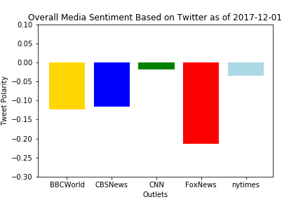

# Distinguishing Sentiments
Homework Week 7 - News Mood

This assignment uses Python libraries and the Tweepy API to perform a sentiment analysis and provide a visualized summary of the sentiments expressed in Tweets sent out by the following news organizations: BBC, CBS, CNN, Fox, and New York Times.

* Observations
    * Overall media twitters have a negative sentiment based on compound scores
    * Fox News has the most negative sentiment rating while CNN has the least negative
    * The sentiment holds true both in quanitity of tweets and in range where Fox News does not have any tweets with a  positive sentiment greater than 0.5

## Python Plots Markdown

```python
# Dependencies
import numpy as np
import pandas as pd
import matplotlib.pyplot as plt
import json
import tweepy
from datetime import datetime
```


```python
# Twitter API Keys
import os
consumer_key = os.getenv("twitter_consumer_key")
consumer_secret = os.getenv("twitter_consumer_secret")
access_token = os.getenv("twitter_access_token_key")
access_token_secret = os.getenv("twitter_access_token_secret")
```


```python
# Setup Tweepy API Authentication
auth = tweepy.OAuthHandler(consumer_key, consumer_secret)
auth.set_access_token(access_token, access_token_secret)
api = tweepy.API(auth, parser=tweepy.parsers.JSONParser())
```


```python
# Import and Initialize Sentiment Analyzer
from vaderSentiment.vaderSentiment import SentimentIntensityAnalyzer
analyzer = SentimentIntensityAnalyzer()
```


```python
# Create array with news outlet twitter handles
    #newsOutlets = ["BBCWorld", "nytimes"]
newsOutlets = ["BBCWorld", "CBSNews","CNN", "FoxNews", "nytimes"]
```


```python
# print a single tweet json for reference
test_tweet = api.user_timeline(newsOutlets[0])
#print(json.dumps(test_tweet[0], sort_keys=True, indent=4))
```


```python
# Create array to hold sentiments
sentiment_array = []
```


```python
# Loop through all media outlets
for outlet in newsOutlets:
    counter = 1   
    
    # For each outlet loop through 5 pages of tweets (total 100 tweets)
    for x in range(5):

        # Get user's tweets, specifying the page
        public_tweets = api.user_timeline(outlet, page=x)

        # Loop through all tweets
        for tweet in public_tweets:
            
            #Get info for each tweet 
                      
            # Get account handle and full user name
            tweet_target = tweet["user"]["screen_name"]
            tweet_name = tweet["user"]["name"]
            
            # Convert tweet date
            converted_time = datetime.strptime(tweet["created_at"], "%a %b %d %H:%M:%S %z %Y")
            
            # Get tweet text
            tweet_text = tweet["text"]
            
            # Run sentiment analysis
            results = analyzer.polarity_scores(tweet["text"])
            pos = results["pos"]
            neg = results["neg"]
            neu = results["neu"]
            comp = results["compound"]
            
            # Place data in a dictionary
            sentiment = {"TweetsAgo":counter,
                         "Target": tweet_target,
                         "User": tweet_name,
                         "Date": converted_time,
                         "Text": tweet_text,
                         "Compound": comp,
                         "Positive": pos,
                         "Neutral": neu,
                         "Negative": neg
                        }
            
            # Append dictionary to master sentiment array
            sentiment_array.append(sentiment)
           
            # **** For testing only print sample tweet info ****           
           # print(f"Tweet# {counter}: {outlet}")
           # print(f"      name: {tweet_name} |  time: {converted_time} | {tweet_text} ")
            
            # Increment counter
            counter +=1
```


```python
# Verify there are 500 total tweets (100 from each)
len(sentiment_array)
```


    500


```python
# Create data frame
sentiments_df = pd.DataFrame(sentiment_array)

#Force column order
sentiments_df = sentiments_df[["TweetsAgo","Target","User","Date","Positive","Neutral","Negative","Compound","Text"]]
sentiments_df.head()
```


<div>

<table border="1" class="dataframe">
  <thead>
    <tr style="text-align: right;">
      <th></th>
      <th>TweetsAgo</th>
      <th>Target</th>
      <th>User</th>
      <th>Date</th>
      <th>Positive</th>
      <th>Neutral</th>
      <th>Negative</th>
      <th>Compound</th>
      <th>Text</th>
    </tr>
  </thead>
  <tbody>
    <tr>
      <th>0</th>
      <td>1</td>
      <td>BBCWorld</td>
      <td>BBC News (World)</td>
      <td>2017-12-01 15:34:41+00:00</td>
      <td>0.000</td>
      <td>1.000</td>
      <td>0.000</td>
      <td>0.0000</td>
      <td>RT @BBCSport: The 2018 Fifa #WorldCupDraw is m...</td>
    </tr>
    <tr>
      <th>1</th>
      <td>2</td>
      <td>BBCWorld</td>
      <td>BBC News (World)</td>
      <td>2017-12-01 15:23:33+00:00</td>
      <td>0.138</td>
      <td>0.781</td>
      <td>0.082</td>
      <td>0.3612</td>
      <td>Flight attendant still working at 81: Bette Na...</td>
    </tr>
    <tr>
      <th>2</th>
      <td>3</td>
      <td>BBCWorld</td>
      <td>BBC News (World)</td>
      <td>2017-12-01 15:22:55+00:00</td>
      <td>0.000</td>
      <td>0.769</td>
      <td>0.231</td>
      <td>-0.3400</td>
      <td>Cohoes fire: Amateur US blacksmith burns down ...</td>
    </tr>
    <tr>
      <th>3</th>
      <td>4</td>
      <td>BBCWorld</td>
      <td>BBC News (World)</td>
      <td>2017-12-01 15:22:55+00:00</td>
      <td>0.535</td>
      <td>0.465</td>
      <td>0.000</td>
      <td>0.3182</td>
      <td>Far-right embrace https://t.co/vUnjzsx2Fm</td>
    </tr>
    <tr>
      <th>4</th>
      <td>5</td>
      <td>BBCWorld</td>
      <td>BBC News (World)</td>
      <td>2017-12-01 14:59:55+00:00</td>
      <td>0.000</td>
      <td>1.000</td>
      <td>0.000</td>
      <td>0.0000</td>
      <td>UN appeals for record $22.5bn humanitarian aid...</td>
    </tr>
  </tbody>
</table>
</div>


```python
# Sort data frame by target and tweets ago
sentiments_df = sentiments_df.sort_values(["Target","TweetsAgo"], ascending=[True, False])
    #sentiments_df.head()
```


## Save to CSV
```python
# Save twitter data to CSV file
sentiments_df.to_csv("recentTweets.csv", encoding="utf-8", index=False)
```


```python
# Create charting data frames for each type
BBC_df = sentiments_df[sentiments_df["Target"]=="BBCWorld"]
CBS_df = sentiments_df[sentiments_df["Target"]=="CBSNews"]
CNN_df = sentiments_df[sentiments_df["Target"]=="CNN"]
FOX_df = sentiments_df[sentiments_df["Target"]=="FoxNews"]
NYT_df = sentiments_df[sentiments_df["Target"]=="nytimes"]
```


```python
#Plot each outlets scatter graph
plt.scatter(BBC_df["TweetsAgo"], BBC_df["Compound"], marker="o", facecolors="gold", edgecolors="black", label="BBCWorld", alpha=0.75)
plt.scatter(CBS_df["TweetsAgo"], CBS_df["Compound"], marker="o", facecolors="blue", edgecolors="black", label="CBSNews", alpha=0.75)
plt.scatter(CNN_df["TweetsAgo"], CNN_df["Compound"], marker="o", facecolors="green", edgecolors="black", label="CNN", alpha=0.75)
plt.scatter(FOX_df["TweetsAgo"], FOX_df["Compound"], marker="o", facecolors="red", edgecolors="black", label="FoxNews", alpha=0.75)
plt.scatter(NYT_df["TweetsAgo"], NYT_df["Compound"], marker="o", facecolors="lightblue", edgecolors="black", label="NYTimes", alpha=0.75)
```


    <matplotlib.collections.PathCollection at 0x270753c84a8>


```python
# Add labels to the x and y axes
curDate = datetime.now().date()
plt.title(f"Sentiment Analysis of Media Tweets as of {curDate}")
plt.xlabel("Tweets Ago")
plt.ylabel("Tweet Polarity")
```


    <matplotlib.text.Text at 0x2707664d438>


```python
# Set your x and y limits
plt.xlim(100, 0)
plt.ylim(-1, 1)
```


    (-1, 1)


```python
# Set a grid on plot and format legend
plt.grid()
#plt.legend(bbox_to_anchor=(0, 1), loc='upper left', ncol=1)
lgnd= plt.legend(bbox_to_anchor=(1.3, 1), loc="upper right", scatterpoints=1, fontsize=10, title="Media Outlets")
lgnd.legendHandles[0]._sizes = [30]
lgnd.legendHandles[1]._sizes = [30]
lgnd.legendHandles[2]._sizes = [30]
lgnd.legendHandles[3]._sizes = [30]
lgnd.legendHandles[4]._sizes = [30]
```


```python
# Save and show plot
plt.savefig("SentimentScatterPlot.png")
plt.show()
```

## Chart of all tweet compound sentiments


```python
# Group the data by media outlet
groupedNews = sentiments_df.groupby(["Target"], as_index=False)
    #groupedNews.head()
```


```python
# Get the average Compound sentiment
avgComp = groupedNews["Compound"].mean()
avgComp.head()
```


<div>

<table border="1" class="dataframe">
  <thead>
    <tr style="text-align: right;">
      <th></th>
      <th>Target</th>
      <th>Compound</th>
    </tr>
  </thead>
  <tbody>
    <tr>
      <th>0</th>
      <td>BBCWorld</td>
      <td>-0.124241</td>
    </tr>
    <tr>
      <th>1</th>
      <td>CBSNews</td>
      <td>-0.115945</td>
    </tr>
    <tr>
      <th>2</th>
      <td>CNN</td>
      <td>-0.018166</td>
    </tr>
    <tr>
      <th>3</th>
      <td>FoxNews</td>
      <td>-0.213103</td>
    </tr>
    <tr>
      <th>4</th>
      <td>nytimes</td>
      <td>-0.035460</td>
    </tr>
  </tbody>
</table>
</div>


```python
# Set up arrays for charting
bar_outlets = avgComp["Target"]
bar_Compound = avgComp["Compound"]
x_axis = np.arange(0, len(bar_Compound), 1)
```


```python
# Create a bar chart based upon the above data
plt.bar(x_axis, bar_Compound, color=["gold","blue","green","red","lightblue"], align="edge")
```


    <Container object of 5 artists>


```python
# Create the ticks for our bar chart's x axis
tick_locations = [value+0.4 for value in x_axis]
plt.xticks(tick_locations, bar_outlets)
```


    ([<matplotlib.axis.XTick at 0x2707536f0b8>,
      <matplotlib.axis.XTick at 0x27075383ba8>,
      <matplotlib.axis.XTick at 0x27075369208>,
      <matplotlib.axis.XTick at 0x270766a1c50>,
      <matplotlib.axis.XTick at 0x270766a95f8>],
     <a list of 5 Text xticklabel objects>)


```python
# Set the limits of the x axis
plt.xlim(-0.25, len(x_axis))

# Set the limits of the y axis
plt.ylim(-.3, .1)
```


    (-0.3, 0.1)


```python

# Give the chart a title, x label, and y label
plt.title(f"Overall Media Sentiment Based on Twitter as of {curDate}")
plt.xlabel("Outlets")
plt.ylabel("Tweet Polarity")
```


    <matplotlib.text.Text at 0x27075369da0>


```python
# Save an image of the chart and print it to the screen
plt.savefig("BarSentiment.png")
plt.show()
```

## Bar Chart tweet sentiments by media outlet



```python

```
